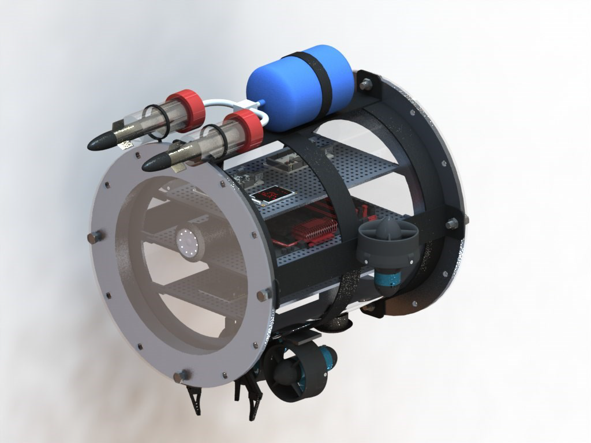
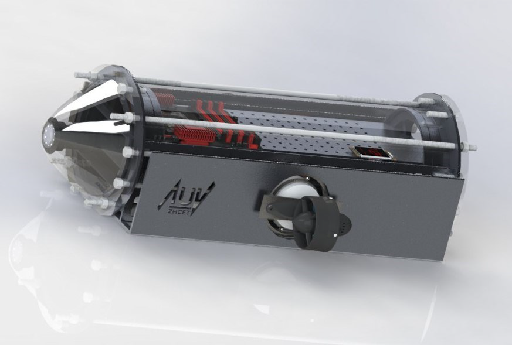
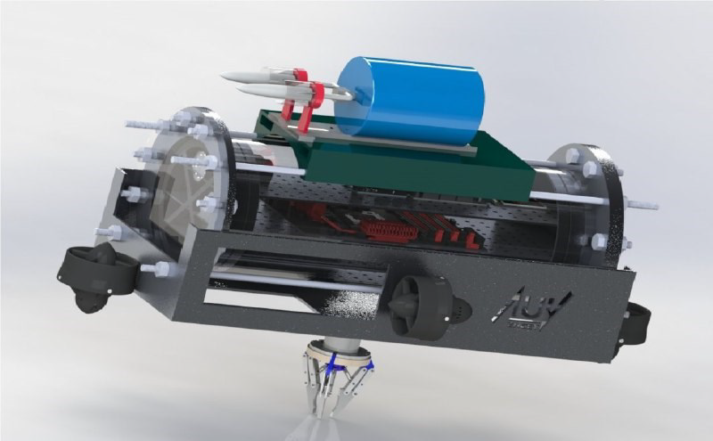
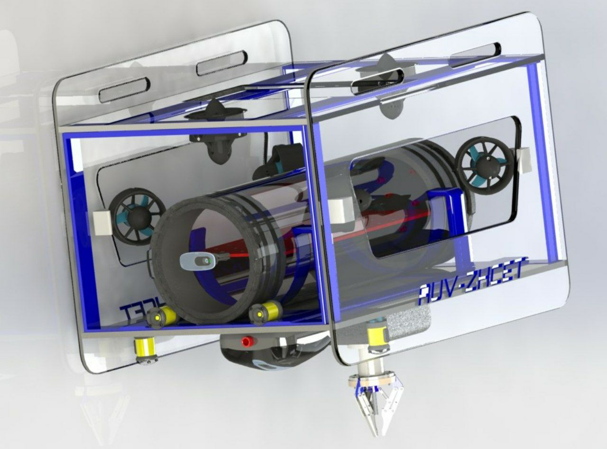
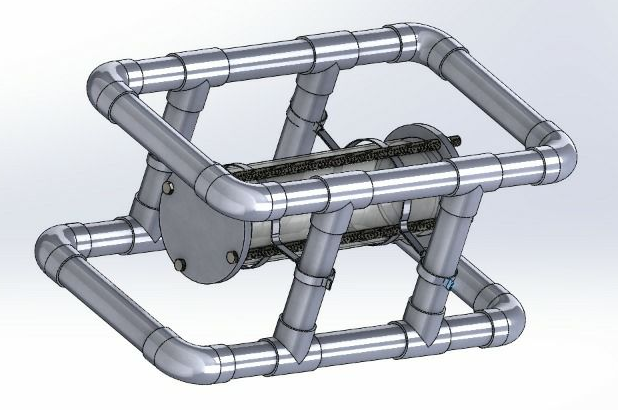

# MTS AUV-ZHCET Club

---

Autonomous Underwater Vehicles Club ([AUV-ZHCET](http://auvzhcet.in/)) is a student branch of [Marine Technology Society](https://www.mtsociety.org/) at Zakir Husain College of Engineering and Technology, [AMU](https://www.amu.ac.in/). The club is dedicated to the development of vehicles, capable of navigating underwater on their own to fulfil tasks pertaining to research, military as well as commercial arenas. Established in 2017, the club is a hub for enthusiastic undergrads from all branches of engineering, to work together on a multidisciplinary project. The club actively participates in national and international AUV competitions, including Singapore AUV Challenge ([SAUVC](https://sauvc.org/)), [RoboSub](https://robosub.org/), Marine Advanced Technology Education - Remotely Operated Vehicle competition ([MATE-ROV](https://www.materovcompetition.org/)) and Students Autonomous underwater Vehicle Competition ([SAVe](https://www.niot.res.in/SAVe/)).

## The Journey: From a group to a team!

It all started in 2012, with a group of like-minded technocrats working on a project under the supervision of [Dr. Saleem Anwar Khan](https://www.amu.ac.in/dshowfacultydata.jsp?did=34&eid=10061770). They participated in [SAVe](https://www.niot.res.in/SAVe/) competition in which they cleared the Conceptual Design Report (CDR) round and appeared in the finals. They had envisioned a club to bring together engineers, designers, and innovators for developing autonomous solutions to underwater exploration challenges. This dream was realized in 2017 when the AUV club came into existence by the tireless efforts of the [founding members](http://auvzhcet.in/). Since then, there was no turning back and the club's been constantly bringing laurels to the university.

### Achievements

- The club won the **'Best Technical Paper Presentation'** at **2nd USCEI, New Delhi** held in July 2012.
- AUV ZHCET Club was recognised among the **top 10 innovative clubs** at the **Festival of Innovation and Entrepreneurship (FINE) - 2018 at Rashtrapati Bhawan, New Delhi**.
- The club received an award for the vehicle’s distinctive design at **Entrepreneurs Summit 2018, Riyadh, KSA**.
- **Competition Record:**

  | Competition            |     Year     | Achievements                              |
  |        :------:        |     :--:     |                  :-----:                  |
  | SAVe organized by [NIOT](https://www.niot.res.in/niot1/index.php) |     2012, 2014 & 2016     | Cleared CDR level & reached finals        |
  | DRDO                   |     2017     | Participation                             |
  | [IIGP](https://www.indiainnovates.in/) organized by [DST](https://dst.gov.in/)  |     2017     | Participation                             |
  | SAUVC                  |     2018     | **“Most Liked Vehicle”** Award                |
  | SAVe organized by NIOT |     2019     | Qualified CDR level & among top finalists |

## The Vehicles

The vehicles have been named *'Safina-E-Aabdoz'* (SEA), an [*Urdu*](https://en.wikipedia.org/wiki/Urdu) phrase which means **'Queen of The Waters'**

### SEA 1.0

- Thrusters: 3  
- Degree of freedom: 4  
- Rotary Thrusters  
- Depth Rating: 25 m  
- Maximum Speed: 1 knot

### SEA 2.0

- Thrusters: 4
- Degree of freedom: 4
- Endurance: 50 mins
- Better Hydrodynamic design

### SEA 3.0

- Thrusters: 4
- Degree of Freedom: 4
- Depth Rating: 50 m
- Maximum Speed: 2 knot
- Enhanced endurance up to 1.5 hrs
- Stereo Vision System

### SEA 4.0

- Thrusters: Vectored 6 Thruster Configuration
- Degree of freedom: 6
- Depth Rating: 50 m
- Maximum Speed: 2 knot
- Endurance: 60 mins
- 2 Cameras: one at front and another at the bottom of the vehicle
- 3 Hydrophones for Underwater Acoustic Source Localization

### ROV

> **WIP**

