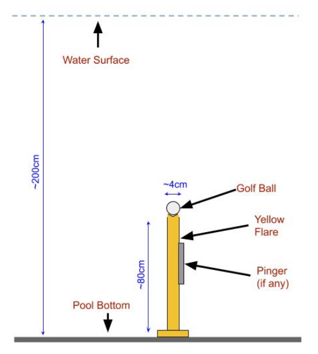
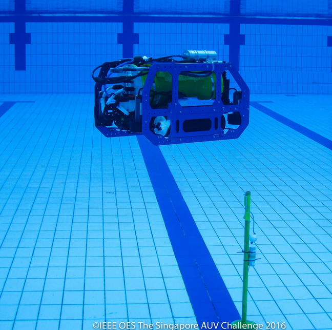
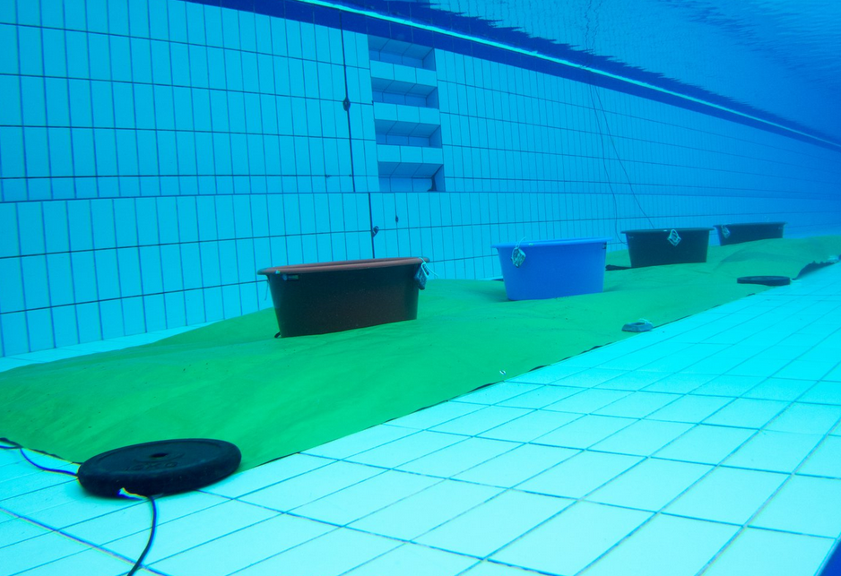
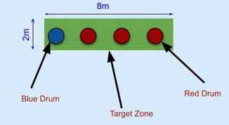
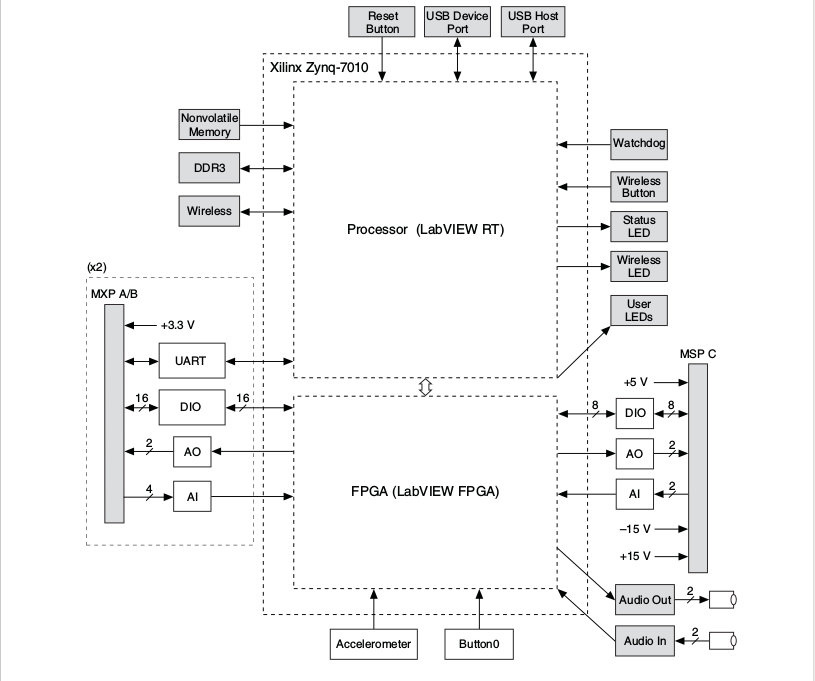
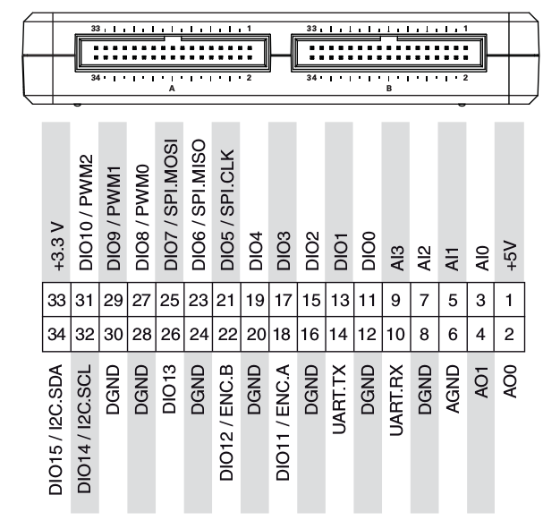

> **WIP**

## Introduction

[Acoustics](https://en.wikipedia.org/wiki/Acoustics) is the branch of physics related to the study of mechanical waves in gases, liquids, and solids. [Underwater Acoustics](https://en.wikipedia.org/wiki/Acoustics#Underwater_acoustics) is the scientific study of natural and man-made sounds underwater. Applications include sonars to locate submarines, underwater communications by whales, et Cetra. To make our AUVs of industrial level standards and perform properly among the different sounds produced underwater, various competitions all around the world incorporate acoustic localization tasks in the arena. For example in [Singapore AUV Challenge](https://sauvc.org/), acoustic pingers located at different props are used for [_target acquisitions task_](https://sauvc.org/rulebook/#2.-target-acquisition) and [_localization task_](https://sauvc.org/rulebook/#4.-localization)). Similarly, the [Robosub competition](https://robosub.org/) conducted by AUVSI also plants different frequency pingers to guide the vehicle around the arena. Check out [Resources - RoboSub](https://robosub.org/resources/) link for their configurations as they change the theme every year.

An acoustic localization system detects a frequency emitting source at a distance, using Time Difference of Arrival (TDOA) of the sound wave.

## Goal

The types of equipment used are comparatively costly and complicated to make this system fuse with the operations of the vehicle. For this reason, the points to accomplish the tasks including a pinger is higher as compared to other tasks.
Check [SAUVC Rulebook](https://sauvc.org/rulebook/) and [mission and scoring](https://robosub.org/resources/) of Robosub competitions.

### Objective

Our first objective is to use the optimum number of hydrophones to detect two pingers emitting 37.5 kHz and 40 kHz frequencies([Specifications](https://ocean-innovations.net/companies/rje-international/acoustic-pingers-and-transponders/)), respectively.

The tasks:

1. Yellow Flare - localization task
This task aims to localize a yellow flare. There is only ONE  yellow flare is marked with an acoustic pinger. This flare could be located anywhere within the main arena. The AUV should locate and bump the flare causing the golf ball on the flare to drop out. The flares will be yellow in color.  
Points would be awarded as follows. If the AUV successfully causes the ball to drop from :
flare with the pinger: 40 Points
[This task from the [rulebook of SAUVC 2018](https://sauvc.org/2018/)]

2. Red Drums - target acquisitions task
There are 4 colored drums in the arena. All of them are on a green mat of size 8m x 2m. One of the drums, chosen at random, will be blue in color, while the rest are red in color. One of the red drums, chosen at random, will contain an acoustic pinger. The AUV needs to drop a ball in one of the drums to complete this task. The location of the red drum which contains the acoustic pinger may be randomized between attempts, as may be the order of the drums.
Points will be awarded as follows.
Drop the ball in the blue drum: 30 Points
Drop the ball in the red drum with the pinger: 50 Points
Dropping the ball in any other red drum: 10 Points

_Source: [SAUVC Rulebook](https://sauvc.org/rulebook/)_

## The survey

We checked Robosub journals of previous years of different teams - ([Past Programs - RoboSub](https://robosub.org/past-programs/)).

## Equipments

1. [H2C hydrophones](https://www.aquarianaudio.com/h2c-hydrophone.html) from [Aquarian Audio](https://www.aquarianaudio.com/) with 3.5 mm TRS output connection.
Key features: Groves for easy mounting, 3.5mm connector & range of detection (10 kHz - 100 kHz)

2. [NI myRIO](https://www.ni.com/en-in/shop/select/myrio-student-embedded-device) embedded board.
Key features:
1.Inbuilt [FPGA](https://www.xilinx.com/products/silicon-devices/fpga/what-is-an-fpga.html) for audio processing.
2.One 3.5mm along with three analog inputs for audio signals.
3.Inbuilt IMU that can be used further for movement of the vehicle.
4.WiFi connectivity.

_Source: [NI MyRIO User Guide and Specification](static/NI_MyRIO_User_Guide_and_Specification.pdf)_

## The process

## Future Work

The assembly of all the components at one place and its optimization is required:
1.Connecting all 3 hydrophones to a microcontroller to receive input without wire/connection interference
2.Processing of audio signals for higher frequencies (50 kHz)
3.Attaching to the vehicle at a certain angle
4.Testing to eradicate reflections of signals form props and sidewalls of swimming pool

## References
