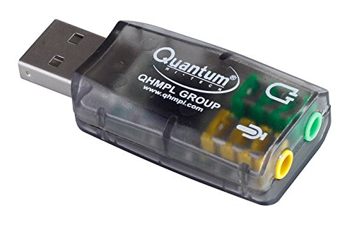

# Report on: **Acoustic Source Localization Subsystem**

> _Under AUV_ during Summer 2020

*This is first in a series of (to be submitted) reports in order to build Acoustic Source Localisation System for our AUV*

---

Submitted by: **Mohd Hozaifa Khan**

Mail: [mhozaifakhan98@gmail.com](mailto:mhozaifakhan98@gmail.com)

Work during: _15 April - 13 May 2020_  

In collaboration with:  *Syed Jawad Akhtar & Mohd. Omama*

Under the Guidance of

**Dr. Saleem Anwar Khan**

_Associate Professor, Mechanical Engg, ZHCET_

_Teacher In-charge_, **_AUV Club_**

Submitted on: 20th July 2020

---

## Summary/Abstract

One of the possible ways of localizing an AUV for Navigation purposes is to determine the location an acoustic source wrt itself and calculating the relative positions accordingly. Therefore the task for Sound Source Localization or SSL is extremely important. In this report I have covered the most basic aspect of SSL which is localization of sound source in a plane using 2 microphones.

---

## Content

1. [Introduction](#introduction)
2. [Technologies Used](#technologies-used)
3. [Methodology](#methodology)
4. [Results and Performance](#results-and-performance)
5. [Problems faced](#problems-faced)
6. [Conclusion and Scope](#conclusion-and-scope) ( _proof read required!!_)
7. [Further Development](#further-developement)
8. [Resources](#resources)

---

## Introduction

Most of the EM Radiations especially RF waves are easily absorbed by water and hence modern localization systems as well as communications system are rendered useless underwater. Underwater Vehicles need to utilize an alternate wave to perform these operations. One such and possibly the most feasible option is Sound. Moreover, Acoustics has already been used in SONARs and so there has been considerable development in its associated technology.

For navigation there is always requirement of a good Positioning system, similar to GPS for terrestrial travels and navigation. One such basic approach is to develop a positioning system with respect to a stationary or terrestrial tracked sound source. This concept is also called Sound Source Localization or Acoustic Source Localization. There are many other applications of this technology as well.

### SSL

There have been various techniques and methods developed for SSL[[2]](#ssl). [Multilateration][multilateration] has already been in application for many years. Others methods are Beamforming, Eigen Vectors based, Neural Networks based, etc. To read in detail click [Here][review-paper] for a Review paper on SSL.

We have used Multilateration from the possible options as it is simple and requires lesser equipment. To quote Wikipedia, Multilateration is a navigation and surveillance technique based on measurement of the times of arrival (TOAs) of energy waves (radio, acoustic, seismic, etc.) having a known propagation speed. Prior to computing a solution, the time of transmission (TOT) of the waves is unknown to the receiver.

There are 3 common techniques under multilateration viz. Received Signal Strength (RSS), Time of Arrival (TOA) and Time Difference of Arrival (TDOA[[1]](#tdoa)).

As pointed out in [this paper](https://ieeexplore.ieee.org/document/5342476/), 
> the accuracy of TOA- and TDOA[[1]](#tdoa)-based localization techniques is better than that of RSS-based localization technique. Moreover, the TOA-based localization technique requires knowledge of the transmission time of the received signal from the transmitter, which is not necessary for TDOA-based localization technique.

Thus, we focused on TDOA-based localization technique.

### SSL: TDOA

One of most used multilateration techniques is TDOA [[1]](#tdoa) or Time Difference of Arrival method. It is similar to Inter-neural.  

Consider the simplest case of Multilateration and TDoA for sound source localization.

Take for instance a sound source S and two detectors or microphones M1 and M2. The simplest case is to determine on which side does the source lie with respect to the center of line joining M1 and M2. Let's refer this point as O.

The possible answers to the Questions _"Which side does the source S lie with respect to O, M1, M2?"_ can be **right** or **left**. A more accurate answer could the angle in degrees or radians subtended by source S at O from Line M1,M2. *Determining this angle in essence is a rudimentary form of Sound Source Localization*.

Due to the unsymmetrical arrangement of Source, there will be a phase difference and hence a path difference in the waves received by M1 and M2. Calculating this path difference can help calculate the angle.

Practically, instead of calculating path difference, it is preferred to determine Time difference between the arrivals of sound at the two detectors or microphones. Hence, the technique is called *Time Difference of Arrival* method or **TDOA**

Most of the development in this technique has been on improving the accuracy of calculation of Time Difference of Arrival. It has been either Hardware based improvement or more accurate Mathematical approximation to the process of determining TDOA. The mathematical improvements have been focused on Cross-correlation is performed. The most famous being GCC, GCC-PHAT and SRP GCC-PHAT.

---

## Technologies Used

**Language**: Python 3.7

**Libraries**:

+ PyAudio  0.2.11
+ SciPy 1.4.1
+ NumPy 1.18.1
+ LibROSA 0.7.2
+ Matplotlib 3.2.1

**Technique** : TDOA (Multilateration)

**Hardware**:

+ 2 Microphones ( Samsung in-ear Headphones )
+ 2 Audio to USB convertors[[4]](#soundcard), which are basically Sound Card Controllers.
+ Laptop

---

## Methodology

We have simply tried to determine the direction of arrival with a resolution of **90 degrees!!**. In simple terms : _left or right_. We placed the two microphones at distance of approximately 20cm and connected them to the computer via audio to USB convertors (sound cards).

Two different Object Streams created by PyAudio keeps listening to the ports on which microphones were attached. We get two different Audio Signals. Remove noise and smoothen the signal. Also, we filter-out irrelevant sound based on frequency.

Perform Rxy[[3]](#rxy).

We haven't gone with the sophisticated way of calculating TDOA or improving the accuracy of Cross correlation using GCC (Generalized Cross-Correlation). We simply determined the sign of Rxy[[3]](#rxy) (Cross Correlation Coefficient) and determined the orientation.

We didn't try it practically, but a simple `numpy.argmax()` of Rxy gives the TDOA, which can be used for Angle Calculation.

## Results and Performance

Work is incomplete to mention any result.

Resolution: not Measured Yet.

Accuracy: Works in some cases.

---

## Problems faced

### Lack of Audio jack ports

The first problem was the lack of no. of input *AUDIO ports*. Most of the Microphones currently support AUDIO jack as input to the system. There is mostly a single USB jack port available in a PC, Board, etc. It was very difficult to receive acoustic data from 2 different devices at the same time.

#### _Our Solution_

We used audio jack to USB convertors since there are multiple USB ports available in most of devices. Also, PyAudio provides support to create two independent streams to listen to different audio ports. Hence, we were able to collect and process data from two different microphones simultaneously.

---

## Conclusion and Scope

SSL is very important and essential capability to be possessed by any group involved in Underwater Vehicles. Once a successful in-house prototype has been developed, it sets-up a platform to improve further in the direction of Underwater Sound/Acoustic Processing. Furthermore, *it also opens up a whole new domain wherein people (students) can work and most importantly explore*.

Also, localization technology is a cross department field and there are numerous future possibility of research, especially when utilizing Neural Networks.  

Further advancement in underwater communications will be probably powered by Sound based Routers and Sound WiFi. These are just to name a few.

In conclusion, it won't be an understatement to say that
> _If Underwater is the least explored part of the Earth then Sound shall be the key to open it up for us_.

So, for the future development of the club and for a world-class underwater vehicle *acoustic system* is something we must procure.

---

## Further Development

Currently our project is in very primitive stage where we have only focused on collecting data and verifying it. It was a crucial step but still there is a very large way to go.

Next update is to develop a 360\* acoustic locator which can work for the whole plane using 3 or 4 microphones.

Later on this Tech has to be transferred to Underwater Localization using Hydrophones.

> *NOTE*: ** many improvements and proof reads required in Theory section.

## Resources

+ A good [Tutorial](https://sites.tufts.edu/eeseniordesignhandbook/files/2017/05/FireBrick_OKeefe_F1.pdf) on TDOA
+ SSL Introduction [Video](https://www.youtube.com/watch?v=Z7X7lf6FdYY) with good explanation

+ [Review Paper][review-paper]
+ ODAS: An open source Multiple Sound source Localization system [ODAS Paper Link](https://arxiv.org/abs/1812.00115)

### Footnotes

<a name="tdoa">[1] </a> TDOA: Time Difference of Arrival

<a name="ssl">[2] </a> SSL: Sound Source Localization

<a name="rxy">[3] </a> Rxy : Cross-correlation coefficient. Mathematically similar to a Convolution operation.  

<a name="soundcard">[4] </a> Quantum. QHM623 3D Virtual 5.1 USB Audio Controller Sound Card (Integrated 2 Channel)

[review-paper]: <https://www.sciencedirect.com/science/article/abs/pii/S0041624X13001819>
[multilateration]: <https://en.wikipedia.org/wiki/Multilateration>