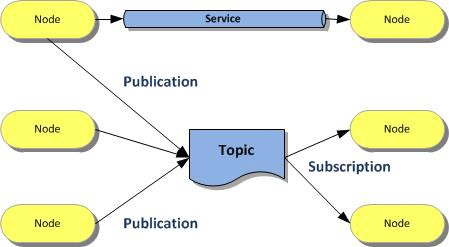

## ROS (Robot Operating System)

**Objective**: Complete ROS revision, Creating a basic talker & listener node.

**Resources**:
 - [ROS tutorials](http://wiki.ros.org/ROS/Tutorials)
 - [_towardsdatascience_  Blog](https://towardsdatascience.com/what-why-and-how-of-ros-b2f5ea8be0f3)
 - [ Overview Video on ROS](https://www.youtube.com/watch?v=vrFFnupcRL4)
 
 **Tech/Software used**: Ubuntu 20.04/ ROS Noetic
 
 **Summary**:
 ROS or Robot Operating System is a middleware, more of a low-level framework responsible for handling the communication between programs in a distributed system. The idea behind using ROS is creation of unique sub-programs (_nodes_) for each particular task. There are various parts of ROS such as topics, messages, nodes, services etc. In Robotics one has to deal with plenty of senosrs & actuators. Instead of creating a single large code-base to run the entire robot, ROS helps us in creating a distributed system for all these components.

|  |
| :---: |
| Fig: Workflow of ROS |

**Procedure**:
A basic talker and listener node will be created. The talker node is responsible for detecting the keyboard input
```
#!/usr/bin/env python3                   #The first line makes sure your script is executed as a Python script.
import rospy 
from std_msgs.msg import String          #String message type will be used for publishing

import getch

def talker():
    pub = rospy.Publisher('which_key', String, queue_size=10) #talker publishes to the topic which_key
    rospy.init_node('key_publisher', anonymous=True) #Tells rospy the name of our node
    rate = rospy.Rate(10)
    while not rospy.is_shutdown():
        key = getch.getch()  
        pub.publish(key) 
          
        rate.sleep()

if __name__ == '__main__':
    try:
        talker()
    except rospy.ROSInterruptException:
        pass
```
The subscriber node will do as it name suggests. It subcribes to our topic `which_key` and logs the message.

```
#!/usr/bin/env python3
import rospy
from std_msgs.msg import String

def callback(data):
    rospy.loginfo("I heard %s", data)

def listener():
    rospy.init_node('key_subscriber', anonymous=True)
    rospy.Subscriber('which_key', String, callback)
    rospy.spin()

if __name__ == '__main__':
    listener()
```
 **Result**: Completed an overview of ROS from various resources. Created a talker/listener setup which detects `keyboard` inputs
 
 **Future Work**: Shift current code to ROS
