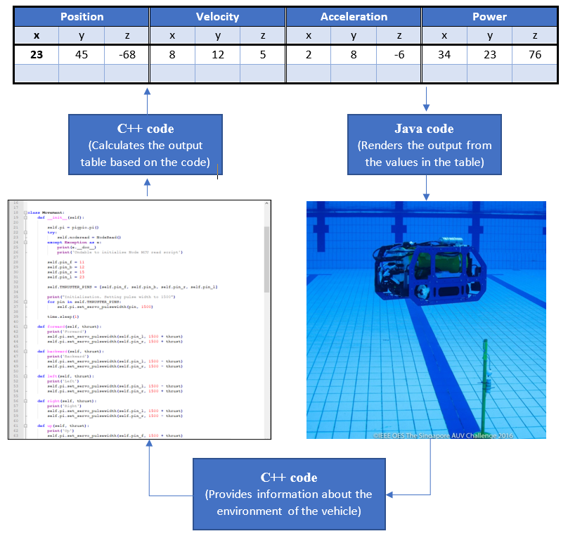

## 1 - An advanced robotic simulator

> **WIP**

### 1.1 Objective

Development of a robotic simulator providing real-time motion simulation governed directly by the Python control code  

### 1.2 Introduction

A major factor hampering the performance of our team in national & international competitions is, according to my understanding, the inability to test the code before the competitions. This is important because, at times, situations arise that we didn’t plan about.  

Two main factors limiting our testing ability are:

- We don’t have any such water body in our city where we can perform field tests.
- Above that, we don’t have much funding to fulfil last minute purchases of parts, i.e., even if we manage to find a place to test, we cannot afford to buy, say, a new thruster, if one fails at the last moment.  

To overcome this problem, I have planned to work on a simulator that could help visualize the output of our vehicle’s control code and help gain insight into its effectiveness.

### 1.3 Software Used

I aim to develop an in-house simulator using C++ for backend purpose and Java for frontend purpose. But presently, I don’t have much knowledge of Java (I have started learning it). I shall be using [Unity](https://unity.com/) in the beginning (as it provides real-time 3D rendering capabilities) but shall switch over to my own Java code when I gain enough experience.  
\* I prefer C++ over python and C as it provides the power of python, while not compromising with the speed (almost equal to C).  

### 1.4 Workflow

Inputs: Vehicle’s control code, CAD of the vehicle.  
The output parameters, such as position, velocity and acceleration of the vehicles are calculated based on the logic defined in the control portion, using the backend program (in C++). The new calculated position is then displayed in the 3-D environment created using Unity. The track of the vehicle would also be defined by directly interfacing in Unity and information from this environment would be fed back to the driving (control) code.  
The following figure explains the workflow.  

|  |
| :---: |
| Fig: Workflow of the simulator |

### 1.5 Progress

- As I am a complete beginner, I have started working on the prerequisites for the project. I learned C++ and am working on Java.
- I plan to learn C# so that I can write my scripts for unity.  

### 1.6 Future Works

Incorporating real-time information about the vehicle such as battery level and the effects of pressure.  

### 1.7 References

- Afzal, Afsoon & Katz, Deborah & Goues, Claire & Timperley, Christopher. (2020). A Study on the Challenges of Using Robotics Simulators for Testing. [Paper](https://www.semanticscholar.org/paper/A-Study-on-the-Challenges-of-Using-Robotics-for-Afzal-Katz/cef409421e17fd4b0a8a216b694338ce3e5e051d)
- N. Koenig and A. Howard, “Design and use paradigms for Gazebo, an open-source multi-robot simulator,” in International Conference on Intelligent Robots and Systems, ser. IROS ’04, vol. 3, 2004, pp. 2149–2154 [Paper](https://scholar.google.com/scholar_lookup?title=Design%20and%20use%20paradigms%20for%20Gazebo,%20an%20open-source%20multi-robot%20simulator&author=N.%20Koenig%20&author=A.%20Howard)  

---  

## 2 - Theory of autonomous robotics

### 2.1 Introduction

Autonomous robotics is a fascinating branch of engineering that requires use of control theory, image processing, acoustics, machine learning, etc. Each of these is based on the concepts of mathematics and physics and I, being passionate about them, look at everything from a mathematical viewpoint. And so, in this case, I studied Linear Algebra, Laplace and Fourier Transforms, and Gaussian statistics which are very important concepts in the development of autonomous vehicles.  

### 2.2 Procedure

- I started with linear algebra (links in the reference section).
- I studied Laplace and Fourier transforms and their applications. Laplace transform is essential for control engineering as most parts of control theory utilizes Laplace domain analysis. Fourier-transform, is also a very powerful tool for signal analysis
- I studied about Gaussian statistics from O'Reilly.
- I studied the basics of control theory
- Finally, I am focussing on the improvement of the design of our AUV  
\* I have enrolled in the self-driving cars specialization on coursera, as I believe to be capable to work on an autonomous underwater vehicle, one must be able to understand and work on the simplest autonomous system – a terrestrial vehicle/car.  

### 2.3 Future Works

Being a biology enthusiast as well, I am always inspired by natural systems. The best examples of autonomous systems are, therefore, the ones that exist in nature. So, inspired by a model of a fish, I think we can improve the design of our vehicles too!  

### 2.4 References

- [Self-driving cars specialization](https://www.coursera.org/specializations/self-driving-cars)
- [Introduction to Control Theory And Its Application to Computing Systems](https://www.cse.wustl.edu/~lu/papers/sigmetrics08_control.pdf)
- [Process Controllers](https://www.engineeringtoolbox.com/process-controllers-d_499.html)
- Liang, Xiao & Pang, Yongjie & Wan, Lei & Wang, Bo. (2009). Dynamic Modelling and Motion Control for Underwater Vehicles with Fins. 10.5772/6720. [Paper](https://www.intechopen.com/books/underwater_vehicles/dynamic_modelling_and_motion_control_for_underwater_vehicles_with_fins)
- [3Blue1Brown: Linear Algebra](https://www.youtube.com/watch?v=kjBOesZCoqc&list=PL0-GT3co4r2y2YErbmuJw2L5tW4Ew2O5B&index=1)
- [3Blue1Brown: But what is the Fourier Transform? A visual introduction](https://www.youtube.com/watch?v=spUNpyF58BY&pbjreload=101)
- [3Blue1Brown: But what is a Fourier series? From heat flow to circle drawings](https://www.youtube.com/watch?v=r6sGWTCMz2k)
- [Zach Star: What does the Laplace Transform really tell us? A visual explanation (plus applications)](https://www.youtube.com/watch?v=n2y7n6jw5d0)
