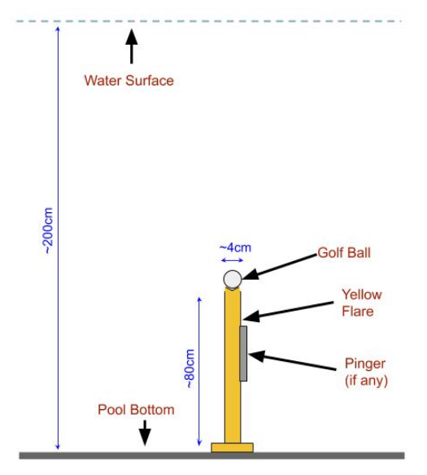
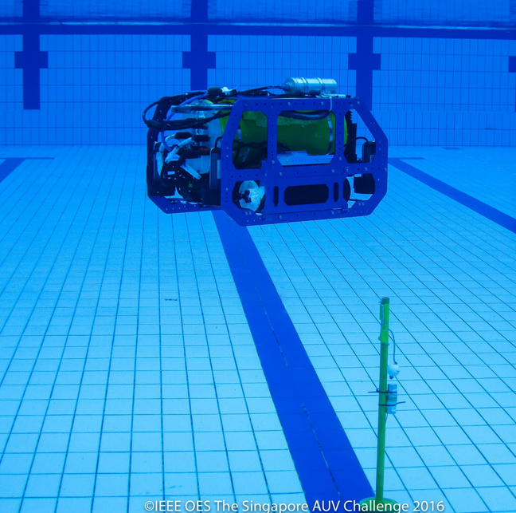
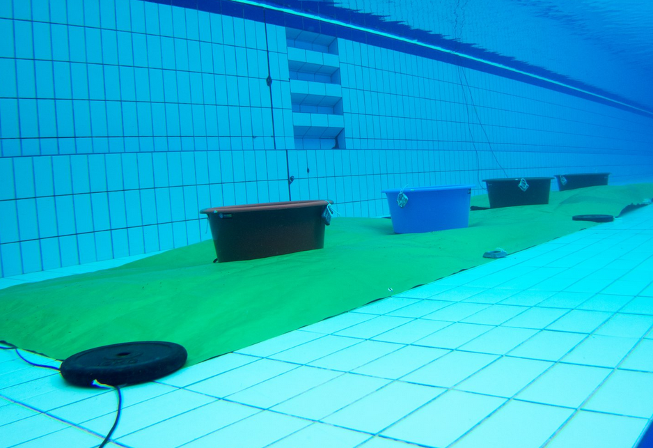
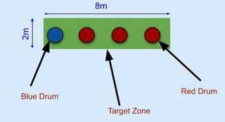
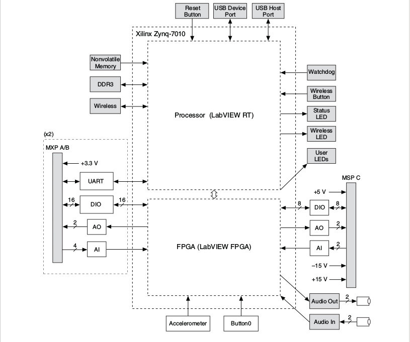
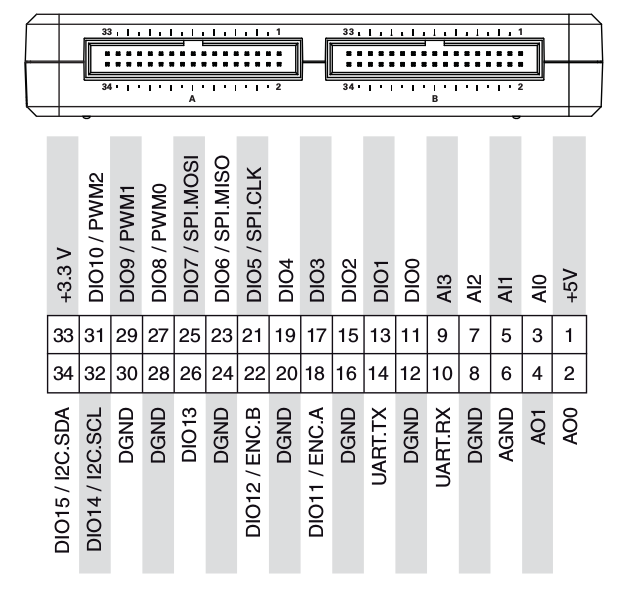
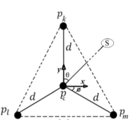
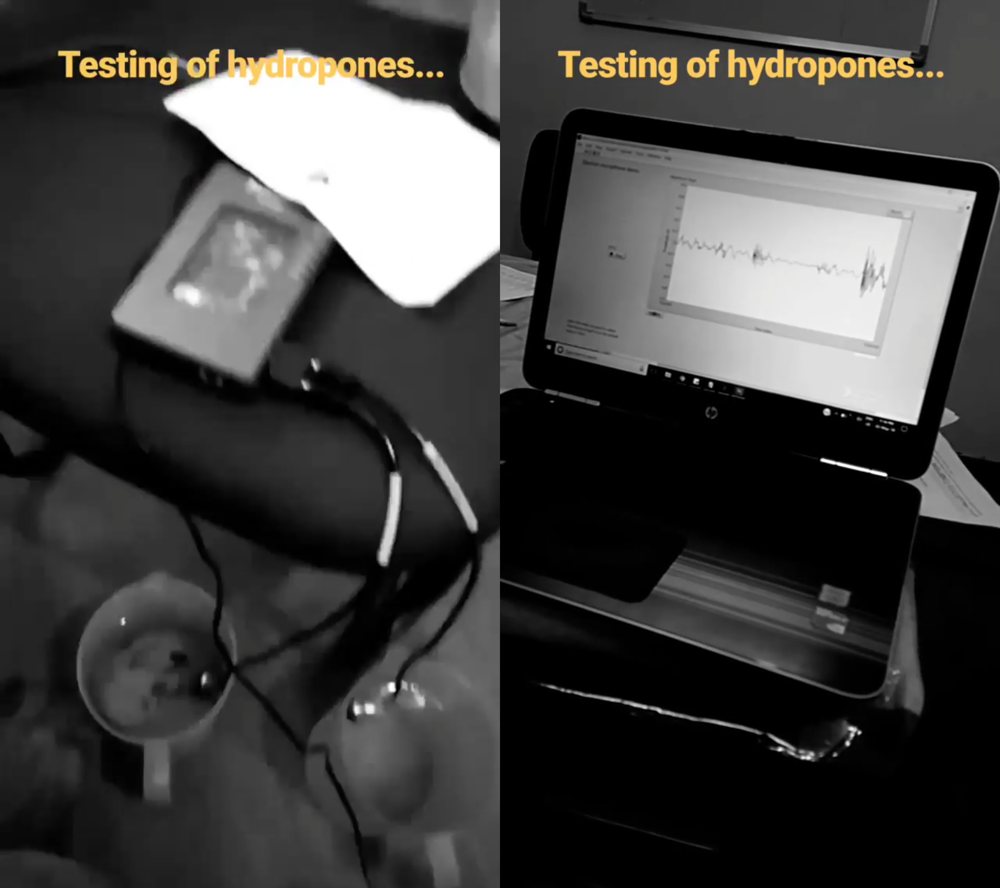
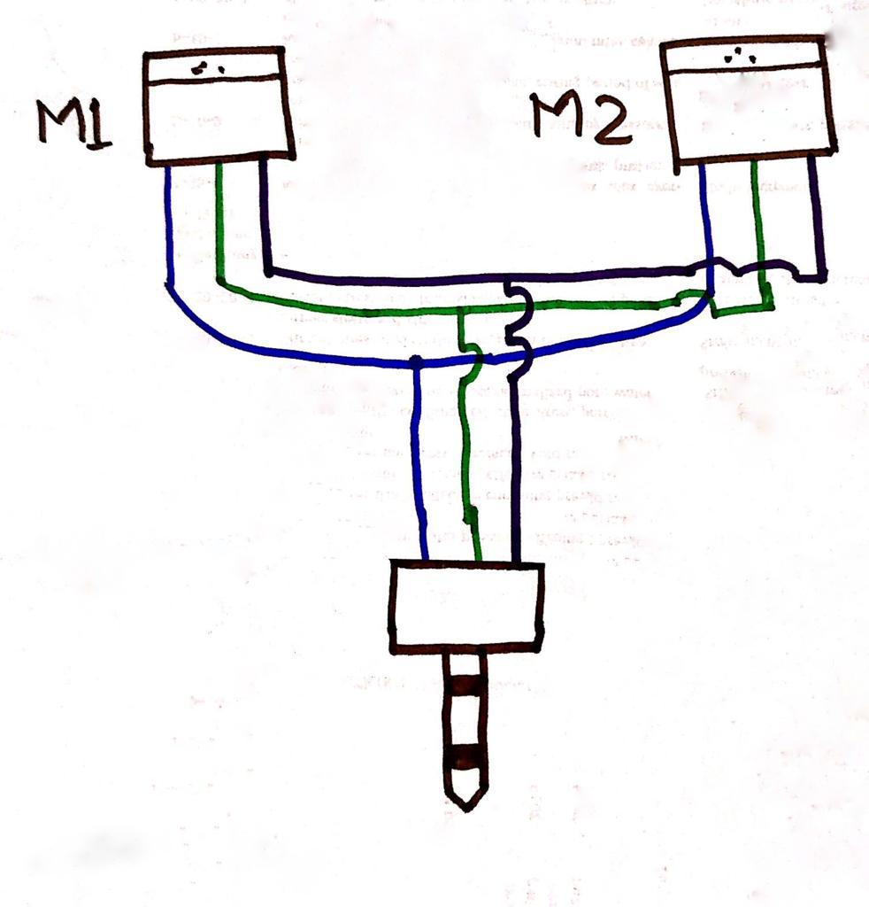
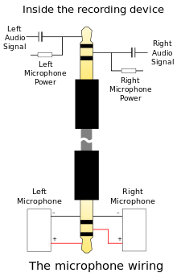

## Introduction

[Acoustics](https://en.wikipedia.org/wiki/Acoustics) is the branch of physics related to the study of mechanical waves in gases, liquids, and solids. [Underwater Acoustics](https://en.wikipedia.org/wiki/Acoustics#Underwater_acoustics) is the scientific study of natural and man-made sounds underwater. Applications include sonars to locate submarines, underwater communications by whales, et Cetra. To make our AUVs of industrial level standards and perform properly among the different sounds produced underwater, various competitions all around the world incorporate acoustic localization tasks in the arena. For example in [Singapore AUV Challenge](https://sauvc.org/), acoustic pingers located at different props are used for [_target acquisitions task_](https://sauvc.org/rulebook/#2.-target-acquisition) and [_localization task_](https://sauvc.org/rulebook/#4.-localization)). Similarly, the [Robosub competition](https://robosub.org/) conducted by AUVSI also plants different frequency pingers to guide the vehicle around the arena. Check out [Resources - RoboSub](https://robosub.org/resources/) link for their configurations as they change the theme every year.

## Goal

The types of equipment used are comparatively costly and complicated to make this system fuse with the operations of the vehicle. For this reason, the points to accomplish the tasks including a pinger is higher as compared to other tasks.

!!! seealso "Check out"
    [SAUVC Rulebook](https://sauvc.org/rulebook/) and [mission and scoring](https://robosub.org/resources/) of Robosub competitions.

### Objective

Our first objective is to use the optimum number of hydrophones to detect two pingers emitting 37.5 kHz and 40 kHz frequencies([Specifications](https://ocean-innovations.net/companies/rje-international/acoustic-pingers-and-transponders/)), respectively.

The tasks:

1. Yellow Flare - localization task
    This task aims to localize a yellow flare. There is only ONE  yellow flare is marked with an acoustic pinger. This flare could be located anywhere within the main arena. The AUV should locate and bump the flare causing the golf ball on the flare to drop out. The flares will be yellow in color.  
    Points would be awarded as follows. If the AUV successfully causes the ball to drop from :
    flare with the pinger: 40 Points
    [This task from the [rulebook of SAUVC 2018](https://sauvc.org/2018/)]

    |  |
    |:--:|
    | Fig. 1: Dimensions of the yellow flare. [_(Source)_](https://sauvc.org/rulebook/)|

    |  |
    |:--:|
    | Fig. 2: Yellow flare underwater. [_(Source)_](https://sauvc.org/rulebook/)|

2. Red Drums - target acquisitions task
There are 4 colored drums in the arena. All of them are on a green mat of size 8m x 2m. One of the drums, chosen at random, will be blue in color, while the rest are red in color. One of the red drums, chosen at random, will contain an acoustic pinger. The AUV needs to drop a ball in one of the drums to complete this task. The location of the red drum which contains the acoustic pinger may be randomized between attempts, as may be the order of the drums.  
Points will be awarded as follows:

    - Drop the ball in the blue drum: 30 Points
    - Drop the ball in the red drum with the pinger: 50 Points
    - Dropping the ball in any other red drum: 10 Points

|  |
|:--:|
| Fig. 3: Drums placed on the green mat underwater. [_(Source)_](https://sauvc.org/rulebook/)|

|  |
|:--:|
| Fig. 4: Target zone dimensions w.r.t. drums [_(Source)_](https://sauvc.org/rulebook/)|

## The survey

We checked Robosub journals of previous years of different teams - ([Past Programs - RoboSub](https://robosub.org/past-programs/)) (_You may check with our club's archives to get old journals not present on the website_).

## Equipments Used

### Hardware

1. [H2C hydrophones](https://www.aquarianaudio.com/h2c-hydrophone.html) from [Aquarian Audio](https://www.aquarianaudio.com/) with 3.5 mm TRS output connection.
Key features: Groves for easy mounting, 3.5mm connector & range of detection (10 kHz - 100 kHz)

2. [NI myRIO](https://www.ni.com/en-in/shop/select/myrio-student-embedded-device) embedded board.
Key features:

    - Inbuilt [FPGA](https://www.xilinx.com/products/silicon-devices/fpga/what-is-an-fpga.html) for audio processing.
    - One 3.5mm along with three analog inputs for audio signals.
    - Inbuilt IMU that can be used further for movement of the vehicle.
    - WiFi connectivity.

3. Lavalier Microphones ([Example product](https://www.amazon.com/Rode-Lavalier-Professional-Wearable-Microphone/dp/B07WM65GTF/ref=sr_1_10?_encoding=UTF8&c=ts&dchild=1&keywords=Wireless+Lavalier+Microphones+%26+Systems&qid=1595430075&sr=8-10&ts_id=11974761))

4. [3.5mm Audio splitter](https://rarecomponents.com/store/1381) - Male stereo to x2 Female stereo

5. Laptop _(HP Pavilion - 16GB RAM/NIVDIA GeForce Graphics/1TB HDD/128GB SSD)_

|  |
|:--:|
| Fig. 5: NI myRIO-1900 Hardware Block Diagram [_(Source)_](static/NI_MyRIO_User_Guide_and_Specification.pdf)|

|  |
|:--:|
| Fig. 6: Primary/Secondary Signals on MXP Connectors A and B [_(Source)_](static/NI_MyRIO_User_Guide_and_Specification.pdf)|

### Software

1. [LabVIEW 2015 myRIO software bundle](http://www.ni.com/pdf/manuals/375388a.html)

## Procedure

### 1. Placement of hydrophones

The first thing decided was to ensure the correct placement of the three hydrophones. They are placed at specific distances in an equilateral shape for accurate results. The shape was chosen on the basis of results of a research paper ([4.](#resources)).
The approximate distance of the placement of the arrays is calculated to be **3 inches apart**. The distance is measured from the center of the hydrophones. The equilateral triangle is to be of the form, as seen in the figure.

| |
|:--:|
| Fig. 7: Star configuration, having four measured signals, i.e., _pc_, _pk_ , _pl_ , and _pm_ [_(Source)_](static/wajid2016.pdf)|

In short: The analog signals from the frequency emitter are detected by the hydrophones placed on our vehicle, which is then passed through a signal processing board. Then the signal is passed through the _Fast Fourier transform_ algorithm, for detecting the exact frequency. The value thus obtained is then passed to the AUVs computer, which commands the thrusters to move towards the detected source.

### 2. Integration with the embedded board

The first two hydrophones were considered to test if the audio is being received and processed properly in myRIO. Since myRIO has only one 3.5mm jack, a _dual mono to stereo connector_ was bought from the local market. We tested it by placing the hydrophones in two jugs with water and testing it with a simple LabVIEW program to check the waveform of incoming audio. The audio was received by flicking at the edge of the jugs, which in turn produced waveforms for the hydrophones to capture audio. But the problem arose when the segregation of the different channels of the audio couldn't be done. Also, the connector didn't seem reliable to carry each signal individually to the hardware. It mixed the completely which couldn't be segregated during audio processing.

|  |
|:--:|
| Fig. 8: The testing setup of two hydrophones on LabVIEW 2015|

In order to protect the expensive hydrophones from getting destroyed from experimentation, two lavalier mics were bought. These mics were tested to get the audio signal placing two sides. To test it we opted to cut the 3.5mm wire to join it in this manner, due to failing in finding a proper connector.

|  |
|:--:|
| Fig. 9: The diagram to show how microphones will be connected for capturing stereo data|

|  |
|:--:|
| Fig. 10: 3.5 mm male connector wiring configuration [_(Source)_](https://en.wikipedia.org/wiki/Phone_connector_(audio)) |

The process for this was:

1. Cut the two lavalier mics at the male connecter to expose the wires.
2. Open up the stereo connector to show each channel i/p connections
3. Solder the same color (right or left channel or ground) wires of the mics
4. Now solder both these wires with the appropriate configurations of the 3.5 mm connector.

This was a mistake from our side as the wires couldn't be joined back properly, and this made the audio completely distorted and sometimes not receiving at all.

## Conclusion

The technique of stripping of the wires for attaching to a connector in audio devices is **NOT RECOMMENDED**. Proper connectors must be used to process to capture audio so that no unnecessary overloaded interference and noise are captured. Though natural disturbances captured can be processed through software but minimizing the irregularities caused by hardware is recommended.

## Future Work

For prototyping using microphones/implementing hydrophone arrays on myRIO toolkit:

1. Find a proper connector/Build a custom ADC to connect 3 audio receivers simultaneously, without interference.
2. Segregate the audio using LabVIEW or other software on myRIO.
3. Usage of Field Programmable Gate Array (FPGA) for audio processing and TDOA.

Overall future aspects required for competing in the competition:

1. Connecting all 3 hydrophones to a microcontroller to receive input without wire/connection interference
2. Processing of audio signals for higher frequencies (50 kHz)
3. Attaching to the vehicle at a certain angle
4. Rigorous testing to ignore bouncing of signals emitted from pinger, from props, sidewalls of the swimming pool, and the surface of the water.

## Resources

1. [Hydrophone Reciever - Theory](https://dosits.org/galleries/technology-gallery/basic-technology/hydrophonereceiver/)

2. [Comparative Study of hydrophones used by other teams](https://github.com/auvzhcet/AUV2k19/blob/master/hydrophones_study.md)

3. Using GCCPHAT (Generalized Cross Co-relation PHase Transform) for finding [Delay of Arrival (DOA)](https://in.mathworks.com/help/phased/direction-of-arrival-doa-estimation-1.html) - Implemented by 2013 ZYRA team.

4. [Design and analysis of air acoustic vector-sensor configurations for two-dimensional
geometry](https://github.com/auvzhcet/Documentation/blob/master/docs/computer/static/wajid2016.pdf) of our Assistant professor [Dr. Mohd. Wajid](https://www.amu.ac.in/dshowfacultydata.jsp?did=32&eid=10061780).
