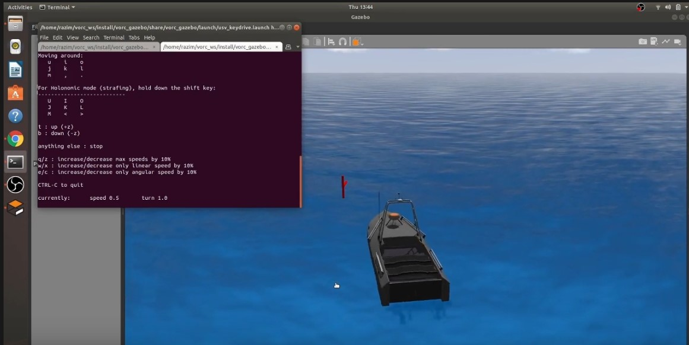
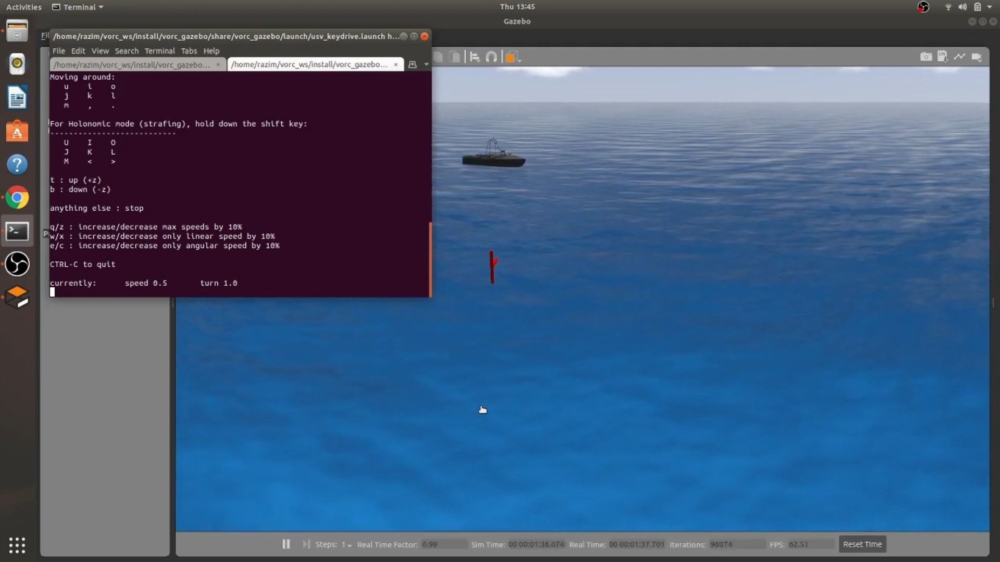

## Set up the ROS environment Locally

- Install ROS according to the ubuntu version.
- Set up the basic workspace.
- Work around the husky Bot
- Set up the teleop Keyboard controls for Husky

## Set up the Local Environment for VORC

- Clone VORC files from github.
- Build the workspace on VORC.
- Install and Run Gazebo on system.
- Run gazebo and VORC (bot) virtually
- Clone the teleop keyboard files
- Build it on same directory as of VORC
- Control the VORC(bot) via keyboard using Teleop key board.

## For Submission

- Record a 2 min video of running VORC.
- Edit the video.
- After final Editing Submit it on Youtube.

## References

- ### Final Video

    

- ### Snapshots of the Project

      
    
