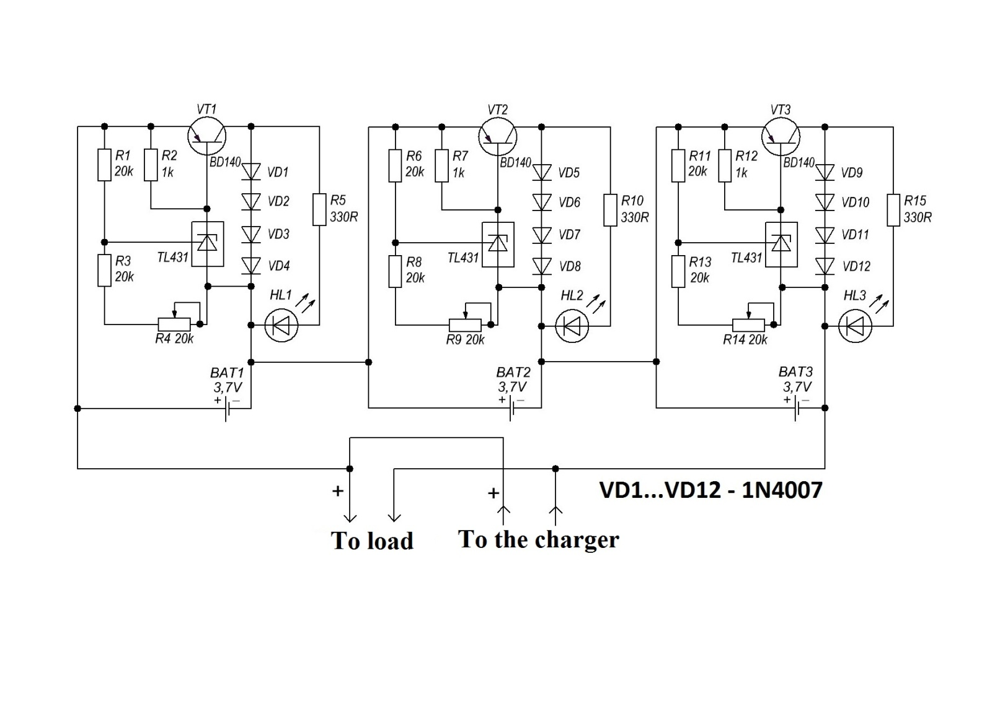
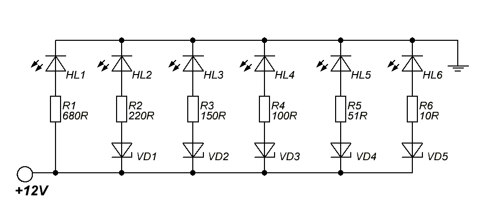
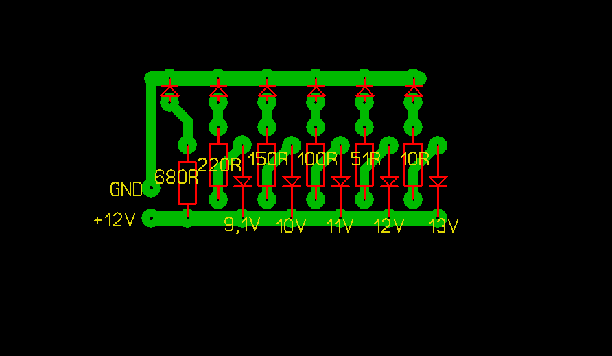
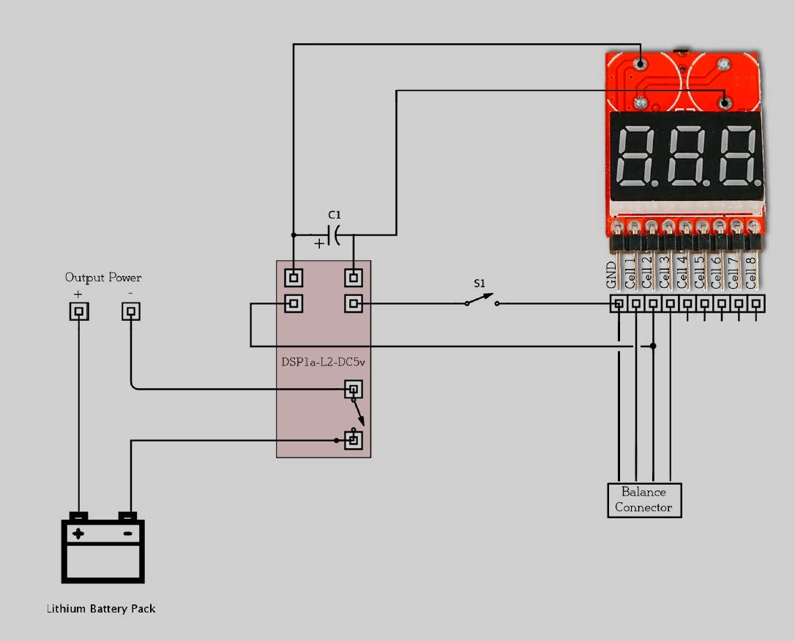

# BMS for lithium polymer battery pack

Battery monitoring is vital for electric vehicles, because the safety, operation, and the life of the battery depends on the battery system. This attribute is exactly the major function of the battery-management system (BMS)—to check and control the status of battery within their specified safe operating conditions. In this article, a BMS method is has been proposed using various circuits. 

## BMS Building Blocks

There are three main objectives common to all Battery Management Systems

- Protect the cells or the battery from damage
- Prolong the life of the battery
- Maintain the battery in a state in which it can fulfill the functional
  requirements of the application for which it was specified.

## Our approach

To design a threefold circuit

- over charge protection
- discharge protection
- battery level indication

We decided to go the analogue rough for the BMS because we wanted to design a PCB and for current and temperature sensing we used an arduino simply because it is easy to logging data, we used lm 35 for temperature and acs712 for current sensing. In case the temperature exceeds the battery's manufacture specified operating temperature the battery will be disconnected from the output power.

## Charge protection circuit

The circuit consists of a regulated Zener diode on the basis of the chip TL431. At a given voltage, a power transistor opens. With the diodes in the collector circuit it form the equivalent of the load.
That is, the excess power will be dissipated as heat on these elements. This assembly will help to charge 3 lithium-ion banks at once.
In theory the number of assemblies can be anything. The board has a tuning resistors to adjust the circuit for the desired cut out voltage. The LED indicator on the collector circuit of the transistor will glow when the transistor is open, thereby indicating that the charging process is complete. 5 mm LEDs are used. Adjustment of the circuit is a simple. Set the voltage in the region of 4.2 Volts on laboratory power supply. Then connect board to it and slowly rotate the trimmer until the LED illuminates. Adjust all balancing units so that the current consumption or balancing current for all was the same.

## Simple voltage level indicator

By the use of zener diodes we are able to determine the voltage level of the battery pack, the power consumption of this circuit is very low.

## Discharge protection circuit

The individual cell voltages are measured and if they are below a set value a inverting relay is set, disconnecting the output power form the battery pack

