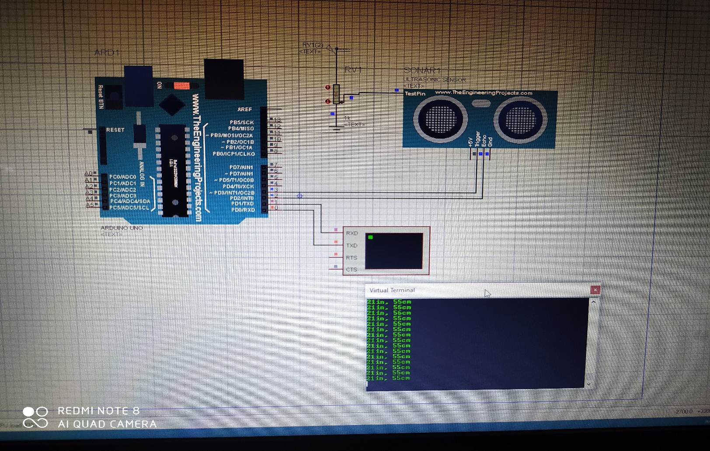

## OBJECTIVE

Understanding and learning about different Software and Hardware that are related to the project.

## INTRODUCTION

During the interval of this summer internship, we learned about various software and hardware that are useful in our project.

- Learned about the different sensors being used in an AUV and their working.These sensors include:

    1. Pressure sensors
    2. Temperature sensor etc.

- Interfacing sensors with the microcontroller using online simulators: We performed simulation of various sensors using Arduino on proteus.The sensors we used were:

    1. Ultrasonic sensor: Ultrasonic sensor is a device that is used to transmit and receive signals from the obstacle.
The equipment’s used in the simulation were;
potentiometer, Arduino (microcontroller), ultrasonic sensor, etc.
    2. Temperature sensor: It is an electronic device that measures the temperature of its surrounding. For simulation, we used the LM35 temperature sensor.The LM35 series are precision integrated-circuit temperature devices with an output voltage linearly proportional to the centigrade temperature.

The equipments used in the simulation were: Arduino UNO, LM35 sensor, Breadboard.

- Upgrading from Arduino to raspberry pi:
Learned about the basic structure and components of Raspberry pi.
Also started learning python for coding of pi.

- PCB designing: Completed learning of schematic designs (PCB) using EAGLE software.

## ONLINE COURSES

NIDHI CHAWLA:

- ‘COMPLETE PYTHON BOOTCAMP’, an online course offered through Udemy.

YUSRA AMIR:

- 'THE ARDUINO PLATFORM AND C PROGRAMMING', an online course authorised by the UNIVERSITY OF CALIFORNIA, IRVINE offered through Coursera.
- 'INTRODUCTION TO THE INTERNET OF THINGS AND EMBEDDED SYSTEMS', an online course authorised by the UNIVERSITY OF CALIFORNIA, IRVINE offered through Coursera.

## EQUIPMENT AND SOFTWARES USED

| S. No.:| Software and Equipment | Version                 |
|:------:|:----------------------:|:-----------------------:|
| 1      | Arduino                | UNO                     |
| 2      | Arduino IDE            | 1.8.13                  |
| 3      | Proteus                | 8.9                     |
| 4      | Eagle                  | 7.6.0                   |
| 5      | Python                 | 3.6.2                   |
| 6      | Electronic Sensors     | Temp sensor, Ultrasonic |

## PROCEDURE

- Interfacing sensors with the microcontroller using online simulators- We performed simulation of various sensors using Arduino on proteus. The sensors we used were:

    Ultrasonic sensor: In ultrasonic sensor, there are two nodes in which one is transmitter while the other is receiver. The transmitter sends an ultrasonic wave and this wave strikes to any hindrance present ahead of it then bounces back. This bounced ultrasonic sensor is then captured by the receiver and on the basis of the time taken by this wave to return, the sensor calculates the distance of that obstacle from that sensor. Ultrasonic sensor is typically used for detecting the obstacle in path and also to seek out the distance between sensor and the obstacle.

1. Firstly, we downloaded the Ultrasonic Sensor Library for Proteus.
2. Then place these files within the library folder of Proteus software.
3. Start the Proteus software and in components list, look for Ultrasonic sensor and place it in your workspace.
4. To feature the functionality double click this ultrasonic sensor and open its properties.
5. In properties, select the Program File section and browse to find the HEX file and upload it.
6. After adding the Ultrasonic Sensor Library for Proteus, open your Proteus ISIS software.
7. Now add the below components available within the Proteus-

    - Components Library in your workspace.
    - Arduino UNO
    - Ultrasonic Sensor
    - LED
    - Variable Resistor(potentiometer)
    - Cell
    - Battery

8. Complete the connections as shown in the fig.
9. Now open your Arduino software and Upload the code.
10. After getting the hex file, now upload it to Arduino in Proteus by clicking the properties.
11. Click on the Start button
The virtual terminal is showing distance values, this value depends on the variable resistance attached to the ultrasonic sensor.

|  |
|:--:|

Temperature sensor:

- It is an electronic device that measures the temperature of its surrounding. For simulation, we used the LM35 temperature sensor.
- The LM35 series are precision integrated-circuit temperature devices with an output voltage linearly proportional to the centigrade temperature.
- It is an electrical sensor which is used to measure temperature of its surrounding. Its output is generated in the form of Electrical signal and this electrical signal is proportional to the input temperature, which it detects.
- LM35 is a 3 pin IC and it is used for temperature detection. The first pin is used for supply from source. The middle pin is its data pin and through this pin LM35 gives its output. The last pin is for GND.
- Open proteus and add the components available within the Proteus Components Library in the workspace.
- Components:

    - Arduino
    - LM35 sensor
    - The VCC pin of LM35 is connected to +5V of Arduino board.
    - Output pin is connected to ‘A0’ pin of Arduino board.
    - Last pin is connected to the GND pin of Arduino board.
    - After connecting the circuit, now write the code.
    - Create the hex file and upload it in Proteus.
    - Hit run.

| .jpg) |
|:--:|

- PCB designing: We designed a PCB using a circuit (sample). The steps followed in the process are:

1. First of all select a circuit to be printed.
2. Install Eagle software on your desktop for designing.
3. After installation has been done, we have to first make schematic diagram of the circuit as it represents the elements involved in a system using graphic symbols rather than realistic pictures connected together in a particular way.
4. Now we will add all the components (transistor, LED capacitor, resistor switch, VCC, ground, etc.) involved in our circuit using ADD option.
5. We can also copy the components by clicking copy icon instead of selecting the same components again and again.
6. Now we will connect the components of the circuit using wire according to the circuit we decided to print.
7. Also add node wherever required. (Sometimes where connection is required is not connected therefore node covers that fault).
8. We can also zoom in and zoom out using the magnifying glass icon or the slider of the mouse.
9. You can also change the shape of wire at different angles.
10. All the grounds in the circuit are internally connected there is no need to connect them through wire.
11. We can change the value of the resistors and capacitors according to our convenience by right clicking on that particular resistor or capacitor and choosing the value option we can give the value we want.
12. Now when we have completed the schematic file, save it. And now it’s time to convert this schematic file into board file.
13. Click on the board icon and press yes.
14. Now we will see a white box which represents the size of PCB that can be made.
15. As all the components are out of that white box, we have to bring them in the box one by one.
16. Moving the components in the box can be done by clicking on the move icon and the on the particular component has to be moved. Right click will help in rotating the component.
17. Place all the components in the box not too far and not too close from the IC.
18. After placing some of the components in the box if you feel that a mess has been created click on the ratsnet icon and this clear the mess a bit. This will help in connection with the shortest path.
19. Keep arranging the components until you find it clear enough.
20. These connections are not fixed yet therefore to fix them we have to do routing. It can be done automatically as well as manually.
21. Now go to edit and then click on Net Classes here have to set the width and clearance (for eg. 40 and 20 respectively).
22. Now go to Autorouter, we can make a 2-layer PCB also but here we will make a single layer PCB. Keep top layer as not available and bottom layer as auto. Then continue and click on start and then evaluate. Do check all the connections.
23. Now set the size of PCB by cropping the white box. We can also name the PCB by entering the text. Now do copper filling by selecting the polygon icon and draw a rectangle then click on ratsnet. Now copper filling has been done. Now the PCB is ready for printing.

| .jpg) |
|:--:|

| .jpg) |
|:--:|
| SCHEMATIC DIAGRAM OF THE POWER MODULE CIRCUIT |

| .jpg) |
|:--:|
| BOARD DIAGRAM OF THE POWER MODULE CIRCUIT |

- Upgrading from Arduino to raspberry pi: Learned about the basic structure and components of Raspberry pi. Also started learning python for coding of pi.

- The Raspberry Pi is a low cost, credit-card sized computer that plugs into a computer monitor or TV, and uses a standard keyboard and mouse. It is a capable little device that enables people of all ages to explore computing, and to learn how to program in languages like Scratch and Python. It’s capable of doing everything you’d expect a desktop computer to do, from browsing the internet and playing high-definition video, to making spreadsheets, word-processing, and playing games.
- Firstly, we started learning python from online courses. We started by getting Python installed. It covers a wide variety of topics, including:

    - Command Line Basics
    - Installing Python
    - Running Python Code
    - Strings, Lists, Dictionaries, Tuples, Sets
    - Functions, Built-in Functions
    - Scope
    - args/kwargs
    - Debugging and Error Handling
    - Object Oriented Programming
    - File I/O

- For the interfacing of sensors in proteus using raspberry pi we needed the library for pi, but we were not able to find it anywhere so we had to stop that in between.

## RESULTS

- Knowledge about sensors and their working was understood.
- Successfully performed simulations of several sensors in Proteus with Arduino (as Pi was unavailable there).
- Successfully completed learning about PCB designing.
- Successfully learnt about all the basics of python needed in raspberry pi coding.

## FUTURE WORK

1. More time would be invested to gain more hands-on experience with the Raspberry Pi environment.
2. To learn interfacing of sensors using pi in proteus.
3. To learn about the future developments that can be made in the ROV to tackle different problems.
4. Learning how to control speed and direction of dc motor.
5. Designing battery management system.
6. Learning more about the tether and power requirements for the ROV.
