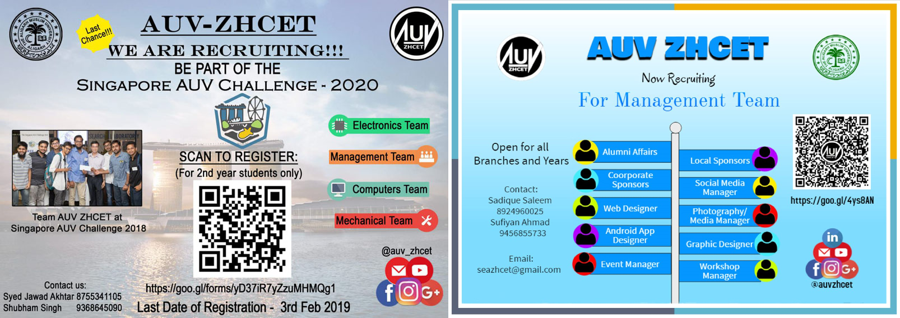

## Creative Coordinator

|  |
|:--:|
| Recruitment posters (_Source: AUV ZHCET Recruitment posts_)|

The role of a creative coordinator is the same as the "Lead Advertisement Specialist" of a company. He/she has to convert every detail of the project in a graphically appealing art for the audience. The CC must be able to use simple lines and figures to transform them into aesthetic posters and designs.
He/She must have at least done a **course on graphic designing** to understand the basics of what captures the mind of this fast-moving society.

There are some of the responsibilities the Creative Coordinator has to keep in mind:

1. Learn the usage software like **(Prerequisite)**
    a. Adobe Photoshop
    b. Canvas
    c. Adobe Illustrator
2. He/she is responsible for making all the posters, banners, pamphlets, newsletters, visiting cards, designing apparel (t-shirts caps), and certificates.
3. All images made and used in the posters must be preserved (except easily found logos; internet pictures and backgrounds)
4. Preserve all the raw photoshop (.psd) files by uploading it on the club's official google drive within the specified folder.

### Resources

A recommended watch to the complete series of **Abstract: The Art of Design** by Netflix to have a better idea.

1. [Abstract: The Art of Design | Bjarke Ingels: Architecture | FULL EPISODE | Netflix](https://www.youtube.com/watch?v=rKeFCd1j5BE)
