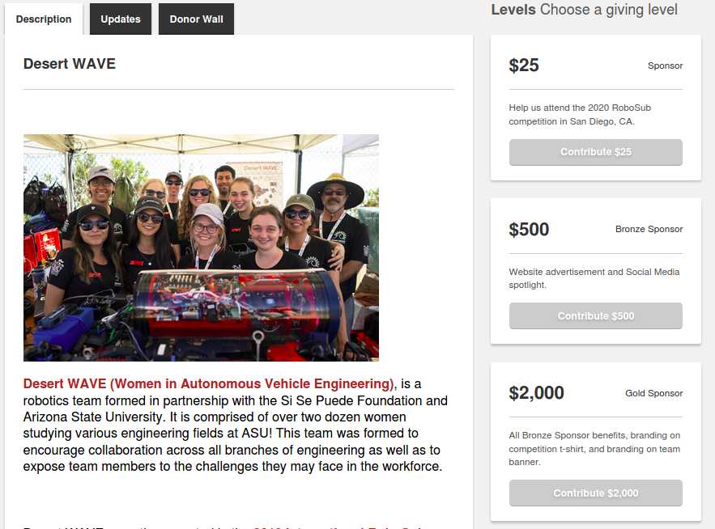
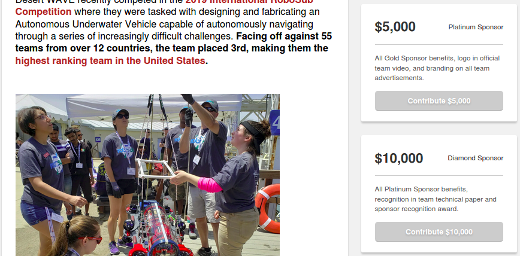

## Online Crowd Funding Campaign

Online crowdfunding is usually done on crowdfunding platforms like [ketto](https://www.ketto.org/), [backmytalent](https://www.backmytalent.com/) or [milap](https://milaap.org/). Our online crowdfunding campaigns usually range from 1-6 months. These platforms help us credible fundraisers and get extensive help from their organizing teams.

Our past online crowd fundings on ketto and backmytalent:

1. [SAUVC 2018](https://www.ketto.org/fundraiser/teamsea)
2. [SAVe 2019](https://www.backmytalent.com/#/project/14/autonomous-underwater-vehicle-from-students-of-auv-zhcet-club) - Checkout the "service plan" in this campaign
3. [SAUVC 2020](https://www.ketto.org/fundraiser/zhcetsauvc20)

### Guide for setting up Online crowdfunding

1. Choose the correct platform.
    - The amount slashed from the total money collected must be less.
    - Provides a trustable platform for national and international funders (supports U.S. Dollars and Indian Rupees)
    - Displays our contents and payment methods in a feasible manner (for both laptop and mobile users)
    - Is not fraudulent (Check reviews from other fundraisers)

2. Though the platforms team helps us to put satisfying content on the platform. But some things are to be decided by us. This requires complete involvement of the **Treasurer** and other members
    - The "Goal" of the crowdfunding must be defined as crystal clear. The details of the competition, Number of members going, duration of stay, etc.
    - The target amount for the crowdfunding.
    - The breakdown of the amount MUST be clearly shown on a pie chart or in any other visual way _(or make a video explaining it)_.
    - The equipment/parts required to enhance the vehicle must be provided with the exact pricing with the vendor's name.
    - The amount of transportation and accommodation must be taken approximately and must be clearly labeled. **The money required for materials must be given high precedence over travel & accommodation.**
    - **Media Manager** must make a specifically tailored video for the crowdfunding platform. It must be as **precise and on point** as possible. (_Most funders just watch the video and if they find it by even a slight way potential, they'll fund it._)
    - Add various levels, based on the amount of money paid by contributors. Like this:

    |  |
    |:--:|
    | Choosing a giving level (Sponsor Bronze, Gold) - Desert WAVE ([_Source_](https://pitchfunder.asufoundation.org/project/16532))|

    |  |
    |:--:|
    | Choosing a giving level (Platinum & Diamond) - Desert WAVE ([_Source_](https://pitchfunder.asufoundation.org/project/16532))|

    - The official club website must be updated with the latest information without any discrepancies.
    - All members must be registered on the crowdfunding campaign so that they have their referral link to share.

3. Once the content is updated. Now it's time to go live
    - All social media platforms including the website must be updated about the campaign.
    - The "sharable link" provided by the platform **must** be used by all the members, to share among their family, friends, and on all their social media platforms.
    - Major milestones must be updated on social media platforms and on the fundraising platform to thank the contributors.
    - The momentum of the campaign has to be **regularly** amplified to make maximum contributions.

> _One of the major amounts deposited during the SAUVC 2018 campaign was due to our member (Marzooqs) LinkedIn post which was tags to almost all prominent professors including Prof. M. M. Sufyan sir. This post was seen by an Alumni in the U.S. who contributed around 60,000/- Rs to AUV ZHCET as well as SAE ZHCET club._

4.Post campaign
    - Either the campaign ends by time OR by achieving the target amount - **Appreciation must be sent to the contributors**
    - Follow up with the platform and complete the transaction process. This will require bank account details (_Or this may be required in point 2_).
    - Keep the contributors updated about the club activities by adding them in the "Contributors mailing list".
    - A collage of all the names of contributors can be made and posted on the vehicle or the "Hall of Fame" in the club.

> **Note: These campaigns are viewed by experienced alumni/persons with a very strong financial background. So any minor discrepancy can be easily pointed out and it can lead to complete failure of the campaign. No Bluffing!!! So the "funds required" must go through several revisions before going live.**

### Resources

- [Crowdfunding Examples: Lessons From The Winners](https://www.oberlo.com/ebooks/crowdfunding/crowdfunding-examples)
