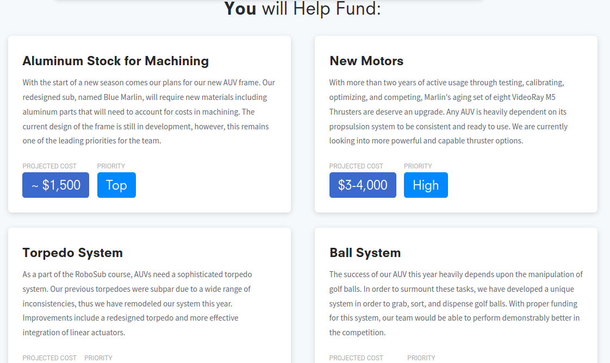
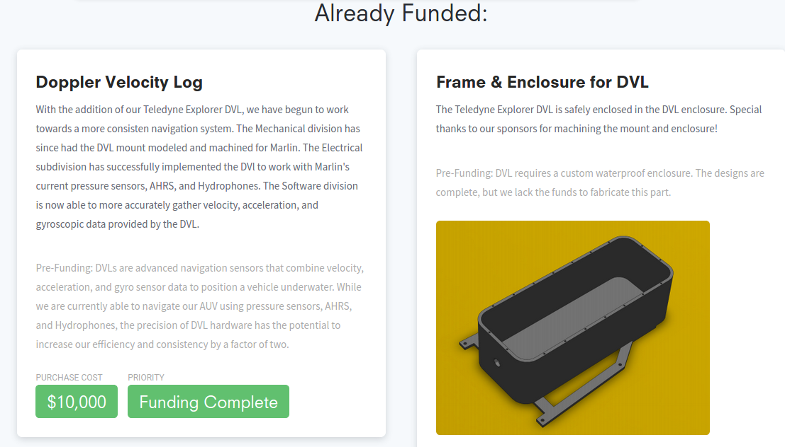

## Sponsorship

A specific role of **Sponsorship Coordinator** is required due to the intensity of the execution of offline and online campaigns.

Proper coordination with **Alumni Relations Officer**, **Social Media Manager**, **Media Manager**, and **Event Manager** are required in these tasks.

Sponsorships are required to get help from industries, Alumni, and prominent people who will help us in either providing equipment or with funds for traveling/accommodation when going for competitions.

### Table of Content

1. [Offline Crowd Funding](offline_CF.md)
2. [Online Crowd Funding](online_CF.md)
3. [Corporate Funding](corp_Fund.md)
4. [Offline Sponsors](offline_Fund.md)

### Resources

1. The resource for a flawlessly working AUV club is [BBAUV](https://bumblebee.sg/) (BumbleBee AUV) of the National University of Singapore. You can look into their wondrous list of [sponsors](https://bumblebee.sg/2018-sponsors/) every year and the sponsorship pamphlet (Insert pdf 2018-2019) of 2018-2019.

2. [Cornell AUV](https://cuauv.org/) - [Fundraising & Marketing](https://blogs.cornell.edu/engineeringprojectteams/fundraising/) - [Sponsors](https://cuauv.org/sponsor) - [Student Teams Fundraising Checklist](insert link to pdf)

3. [Amador Valley High School](https://www.avbotz.com/fundraising-progress.html) - for the marvelous progress bar.

    |  |
    |:--:|
    | Fund Raising Progress bar - AVBot ([_Source_](https://www.avbotz.com/fundraising-progress.html))|

    |  |
    |:--:|
    | You will help fund - Price and Priority - AVBot ([_Source_](https://www.avbotz.com/fundraising-progress.html))|

    |  |
    |:--:|
    | Already Funded - Purchase cost and status - AVBot ([_Source_](https://www.avbotz.com/fundraising-progress.html))|

4. Outreach - <https://duke-robotics.com/outreach/>
