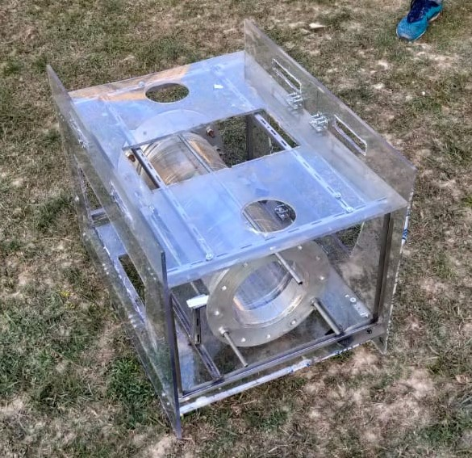
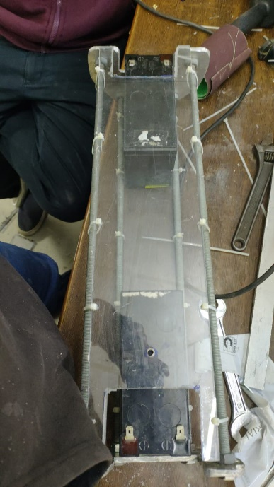
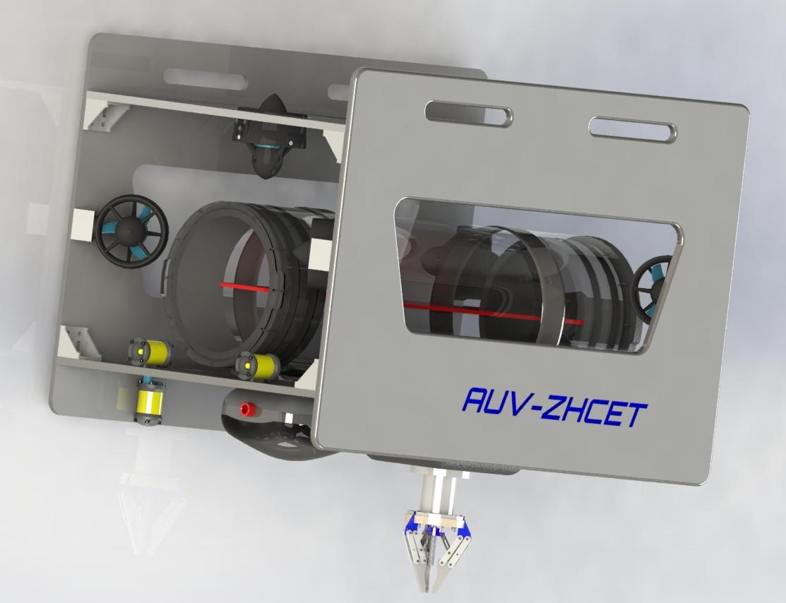

## Objective

- Fabrication of Autonomous Underwater Vehicle (AUV) for SAUVC 2020.
  - Fabrication of the Frame.
  - Leak Proofing of the Frame.
  - Buoyancy checking of the Frame.
- To design and fabricate an electronic tray for the SEA 4.0.

## Introduction

AUV stands for autonomous underwater vehicle and is commonly known as unmanned underwater vehicle. AUVs can be used for underwater survey missions such as detecting and mapping submerged wrecks, rocks, and obstructions that can be a hazard to navigation for commercial and recreational vessels.
The following techniques and software were used for performing the tasks:

- Material Cutting
  - Cutting of layers of sheet of different materials like metal, plastic etc using appropriate tools.
- Drilling
  - Cutting process that uses a drill bit to cut a hole of circular cross-section in solid materials.
- Filing
  - A material removal process in manufacturing using a file.
- Surface Finishing
  - Smoothening of the sharp/irregular surfaces to avoid cutting while handling the sheets.
- Hole Making
  - Process of making holes on the surface for mounting purposes.
- Leak Proofing
  - Checking of any leaks in the hull to avoid short circuiting of the electronics hardware.
- Buoyancy Checking
  - To check the stability in the

## Equipment/Software Used

The various equipment used for the tasks are as follows:

- __Hardware__
  - Mechanical Equipments: Drill machine, Grinder, Double cut file, Jig saw, Bench vice, Wrench, Zip Ties.
  - Materials: End caps, O rings, Nozzles, Thick aluminium rod (studs), M seal, Araldite, Silicon gel, Acrylic sheet, Stainless-steel u-shaped rods, Mounting rings for hull, Mounting rings for thrusters, Weight.
- __Learning Platform__
  - Google
  - Udemy
  - YouTube

## Procedure

1. __Fabrication of the Frame.__

    For starting the fabrication of the AUV, we purchased the required materials and components. After that, the process of fabrication started by the following order:

    - Sheet Cutting
    - The acrylic sheets were cut by the dimensions of the CAD design with the help of grinder by applying proper cutting blades.
    - Working on Stainless Steel Frame
    - Welding the stainless-steel rods to make an internal frame for the main frame to make it rigid.
    - Mounting of the frame
    - The acrylic sheets were then mounted to make the frame of the AUV.
    - Working on the hull
    - After the mounting of the hull we started working on the hull of the AUV. In that we drilled holes in the end caps for the nozzles and studs.
    - O rings were attached to the end caps and attached to the hull.
    - Attaching the hull in the frame
    - After the completing the work on the hull we installed the hull in the frame, which concluded the task.

    |  |
    |:--:|
    | Fig 1. Final Frame after complete fabrication |

2. __Leak Proofing of the Frame.__

    After the fabrication of the frame we started the leak proofing of the hull to avoid the short circuiting of the electronic hardware.

    - Sealing the blank spaces
    - We sealed the spaces between the hull and the end cap by applying the mixture of araldite and silicon gel in the spaces.
    - Verifying
    - We tested the applied area by submerging it into water for long durations and it performed really well.

3. __Buoyancy checking of the Frame.__

    After the leak proofing, we tested the whole frame in a swimming pool for its buoyancy in which it performed well.

4. __Fabricate the electronic tray for the SEA 4.0.__

    For the fabrication of the electronic tray we used the acrylic sheets and zip ties. The acrylic sheet was tied around the aluminium studs of the previous electronic sheet to give extra working space.

    |  |
    |:--:|
    | Fig 2. Final prototype of the electronic tray |

## Results

- Fabricated the AUV SEA 4.0 for SAUVC 2020
- Designed and fabricated an electronic tray

|  |
|:--:|
| Fig 3. CAD design of the AUV SEA 4.0 |

## Future Works

For future enhancements:

- Designing and fabricating a robotic gripper for the AUV.
- Attachment of a camera in the AUV.
