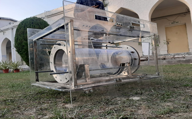

## Objective

- Learn SolidWorks.
- Use Arduino to interact with buttons, LEDs, motors, speakers, GPS units, cameras and the internet.
- Controlling a servo motor using Arduino in Proteus.
- Leak proofing of the hull.
- Fabrication of the AUV (SEA-4.0).
- PCB Designing for the AUV. The design should include all the electronic equipments (sensors, ESCs etc).

## Introduction

- SolidWorks: SolidWorks is a solid modeling computer-aided design (CAD) and computer-aided engineering (CAE) computer program.
- Arduino: Arduino is an open-source hardware and software company, project and user community that designs and manufactures single-board microcontrollers and microcontroller kits for building digital devices.
- PCB designing:  PCB is a printed circuit board that uses pads, tracks and lines incorporated on a single board to electrically connect the electronics components.

## Equipment

__Software__:

- SolidWorks for 3D designing.
- EAGLE for PCB designing.
- Proteus 8.0

__Hardware__:

- Mechanical Equipments: Drill machine, Grinder, Double cut file, Jig saw, Bench vice, Mallet, Chisel, Wrench, Nails.
- Materials: End caps, O rings, Nozzles, Aluminum sheet thin, thick aluminum sheet/rod (L), M seal, Silicon gel, acrylic sheet, mounting rings for hull , mounting rings for thrusters, weight, pvc sheet thick for arm.

## Procedure

Leak proofing of hull:

- Fixing end caps at both the ends of the hull with the help of studs.
- Using O rings while fixing end caps.
- Applying silicon gel and allow it to dry.
- At last testing of the hull to detect any leakage.
Fabrication:
- Cutting of the acrylic sheets according to the dimensions.
- Mounting of the sheets with the help of bolt and nuts.
- Using stainless steel structure to give support and stability to the vehicle.
- Welding of clamps for fixing the hull inside the structure.
- Spray painting for final touch.

|  |
|:--:|

PCB designing:

- Learning software to accomplished the given task
- Analyzing proper equipments to be used.
- Designing the PCB in accordance to get best possible output.
- Design in such a way so that less space is used, easy connections are provided, etc.

## Result

- I have learned PCB designing through EAGLE software and have practiced some basic schematic designs.
- I have learned SolidWorks .
- I have got to know importance of selecting different materials for different purposes.  

## Future work

I am discussing appropriate components to be used for PCB making with team head and will finalize my PCB design soon.
