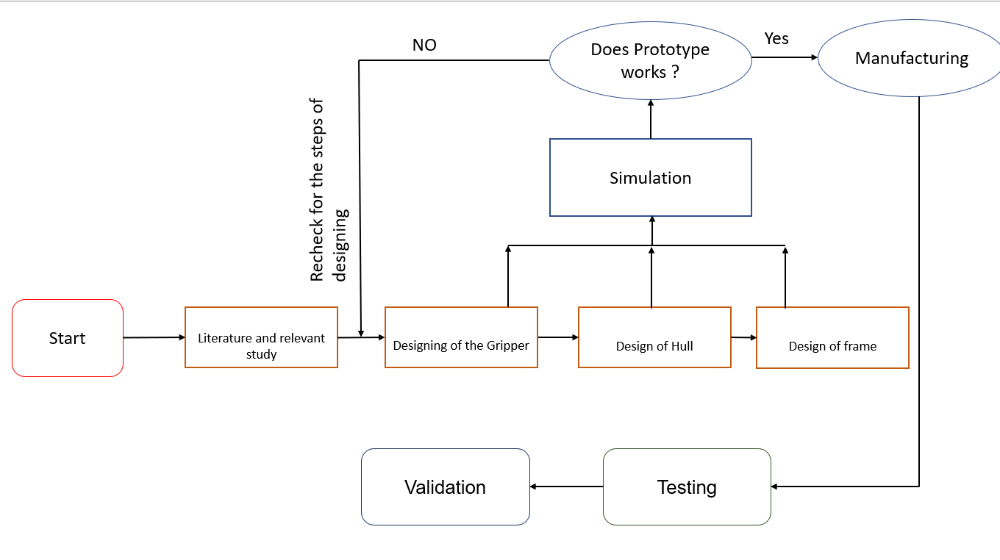
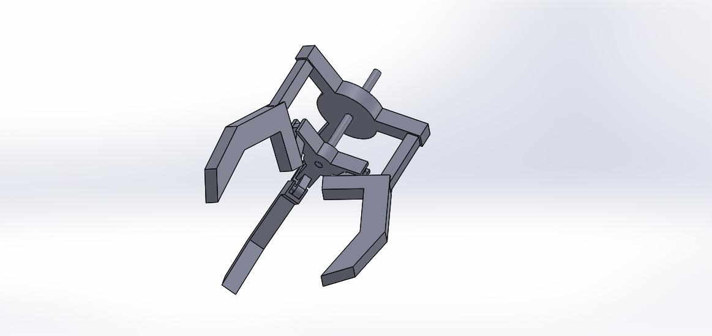
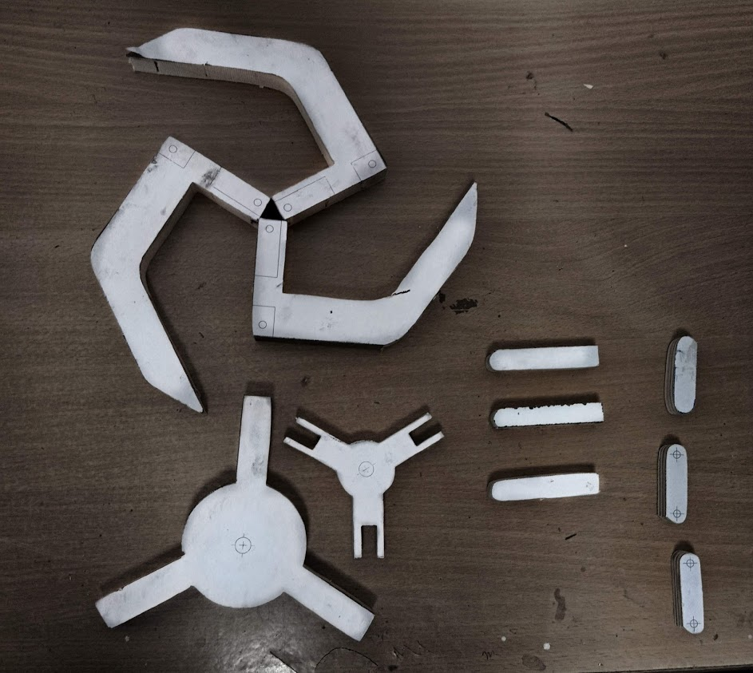
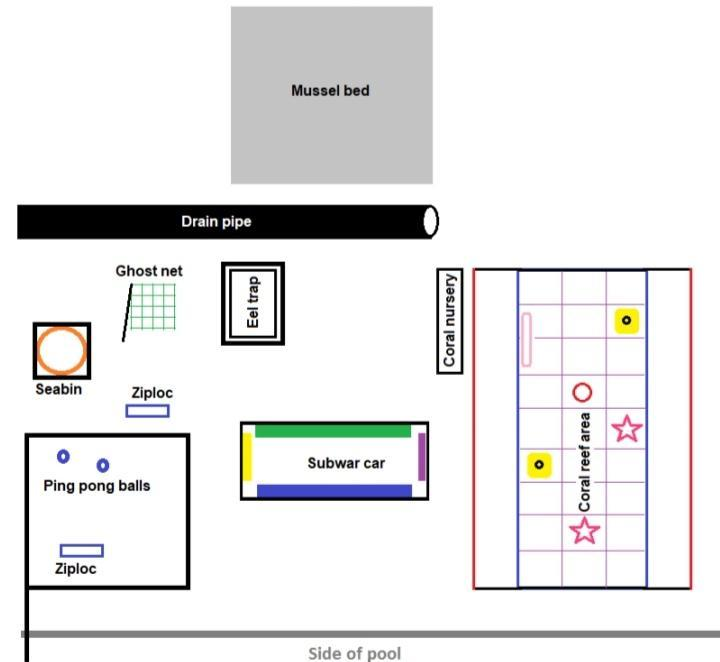
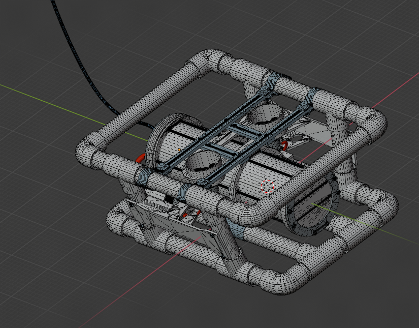
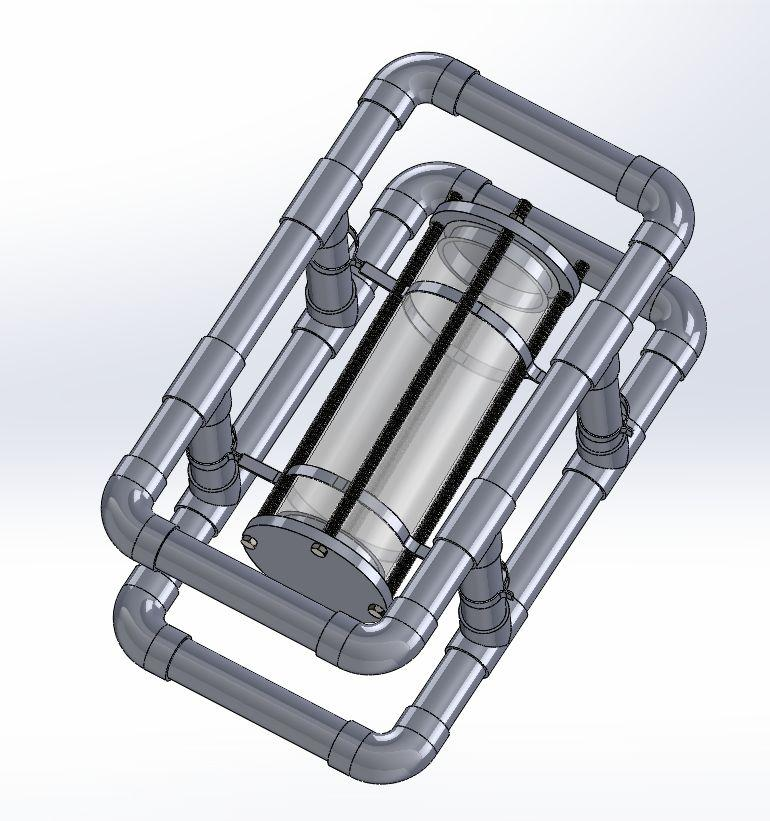
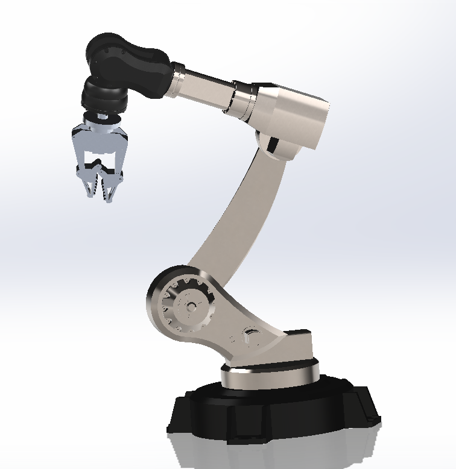
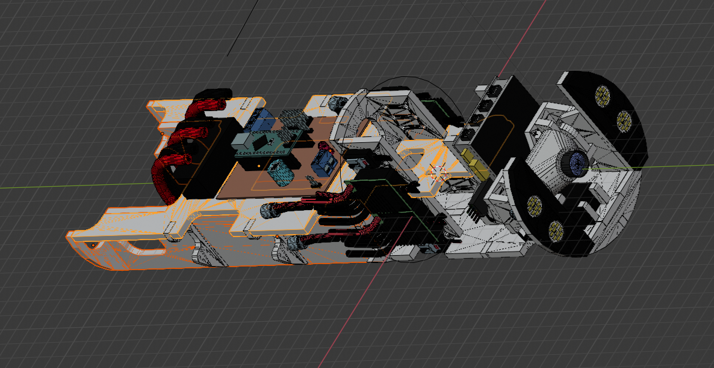

## Objectives

- Fabrication of Autonomous Underwater Vehicle (AUV).
  - Fabrication of the frame.
- Designing and fabrication of a Remotely Operated Vehicle (ROV).
  - Designing and fabrication of frame.
  - Designing and fabrication of hull.
  - Designing and fabrication of gripper.

## Introduction

AUV stands for autonomous underwater vehicle and is commonly known as unmanned underwater vehicle. AUVs can be used for underwater survey missions such as detecting and mapping submerged wrecks, rocks, and obstructions that can be a hazard to navigation for commercial and recreational vessels.
A remotely operated vehicle (ROV) is an unoccupied underwater robot that is connected to a ship by a series of cables. These cables transmit command and control signals between the operator and the ROV, allowing remote navigation of the vehicle. An ROV may include a video camera, lights, sonar systems, and an articulating arm.

## Equipment/Software Used

- __Hardware__
  - Mechanical Equipments: Drill machine, Grinder, Double cut file, Jig saw, Bench vice, Mallet, Chisel, Wrench, Nails.
  - Materials: End caps, O rings, Nozzles, Aluminum sheet thin, thick aluminum sheet/rod (L), M seal, Silicon gel, acrylic sheet, mounting rings for hull , mounting rings for thrusters, weight, pvc sheet thick for arm.
- Software
  - SolidWorks 2020
  - ANSYS 2019
  - Learning Platform
  - YouTube
  - Google
  - Udemy

## Procedure

The design of the ROV starts with the relevant study and starts with the designing and simulation. After designing we start making a prototype. After prototype we headed towards manufacturing and testing .The flow diagram of the approach that we make is shown in fig.1.

|  |
|:--:|
| Fig.1 Flow diagram of work |

First, we start making the design of a gripper for the robotic arm, for better gripping we choose 3 finger grippers. The design was made in SolidWorks and for prototypes we use wood as it is easily available. Following steps are used for making prototype:

1. Make a drawing of each component in the SolidWorks drawing.
2. Print the drawings and just paste them on the wood parts.
3. The parts are cut by using a jigsaw.
4. Parts are drilled according to dimension.
5. For joints we use steel rod of same dimension as that of hole with  0.01mm tolerance.
6. Finally the parts are joined and ready to add the motor.
7. For converting the rotary motion of the motor we weld a rod to the shaft of the motor and insert the rod in the gripper.
8. For converting the rotary motion of the shaft into translatory motion we weld a bolt into the lower moving part of the gripper and shaft rotate the translatory motion causing it to open and close the gripper.

|  |
|:--:|
| Fig.2 Gripper Assembly |

|  |
|:--:|
|  Fig.3 Prototype parts |

After finishing the Robotic Arm we headed towards the making of the hull for the vehicle which is responsible for balancing the cg of the vehicle also to wrap the electronic components. The first priority of the hull is to make it waterproof we performed the following approaches:

- 1st Try: We'd try to use interference fit for the hull and it's cap. This method was successful for stationary water but it fails when moved.
- 2nd Try: We'd use the same pair of hull and cap and make it more tight with the help of O rings and glue gun first, then with the help of the tire's tube, then O rings and motor tape and glue gun and quick fix, But all these methods don't work.
- 3rd Try: We'd apply some silicon gel on the surface of it, without removing O rings.
Due to the water repelling and sticking quality of silicon gel this method worked for the permanently fixed side of the hull.

We've purchased the relevant components (as given in the instruction manual).

Instructions guidelines (for how props will look in future) and the CAD drawing of our vehicle are given below:

|  |
|:--:|
|  Fig.4  Arena (from Instruction Manual) |

|  |
|:--:|
|  Fig. 5: Design of Frame (a) |

|  |
|:--:|
|  Fig. 5: Design of Frame (b) |

## RESULTS

Following are outcomes of our work:

- We've successfully manufactured a working prototype of gripper and it can now be used for an actual model.
- We successfully made the design of the ROV.
- We have made the hull , but we were successful in making only one part sealed .Since the other opening of the hull must be temporary so that it can easily be removed when required , we face lots of challenges in making that waterproof, though we tried many methods as discussed above.

## FUTURE WORK

- Waterproofing of temporarily  fixed parts of the hull by using flanges/caps.
- Assembly of hull, thrusters, gripper and frame.
- Buoyancy check and working of the Assembly (underwater).
- Failures and improvements in the vehicle under different circumstances.
- Further work can be done on the design of the gripper with addition of the degree of freedom.We have made a proposed design in Fig.6. (designed in solidworks)
- The metal plate for holding the electronic components can be made as shown in Fig.7.
(The Fig.6 is not designed by us; it is for reference only that we found it on the internet.)

|  |
|:--:|
|  Fig.6 Proposed design of gripper. |

|  |
|:--:|
|  Fig.7  Proposed design of metal plate |
