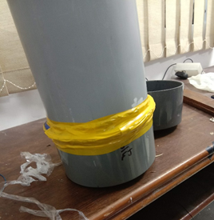

## OBJECTIVE:

The main aim of designing Remotely operated underwater vehicle (ROV) are :  
1) To design a vehicle that is based on the rules as per the guidelines provided by MATE  
2) To make a waterproof hull that can be used for placing electrical equipment underwater.  
3) To design a robotic arm that can be used to perform the task in the competition arena.

## INTRODUCTION : 

Remotely operated vehicles, or ROVs, allow us to explore the ocean without actually being in the ocean. These underwater robots are controlled by a person typically on a surface vessel, using a joystick in a similar way that you would play a video game. A group of cables, or tether, connects the ROV to the ship, sending electrical signals back and forth between the operator and the vehicle. Most ROVs are equipped with at least a still camera, video camera, and lights, meaning that they can transmit images and video back to the ship. Additional equipment, such as a manipulator or cutting arm, water samplers, and instruments that measure parameters like water clarity and temperature, may also be added to vehicles to allow for sample collection. First developed for industrial purposes, such as internal and external inspections of underwater pipelines and the structural testing of offshore platforms, ROVs are now used for many applications, many of them scientific. They have proven extremely valuable in ocean exploration and are also used for educational programs at aquaria and to link to scientific expeditions live via the Internet.ROVs range in size from that of a small computer to as large as a small truck. Larger ROVs are very heavy and need other equipment such as a winch to put them over the side of a ship and into the water.  
While using ROVs eliminates the “human presence” in the water, in most cases, ROV operations are simpler and safer to conduct than any type of an occupied-submersible or diving operation because operators can stay safe (and dry!) on ship decks. ROVs allow us to investigate areas that are too deep for humans to safely dive themselves, and ROVs can stay underwater much longer than a human diver, expanding the time available for exploration.

## EQUIPMENT / SOFTWARE USED :

- **Software:** Solidworks 2019 student version.
- **Mechanical Equipment:** Drill machine, double-cut file, jigsaw, bench vice, mallet , chisel, wrench, nails.
- **Other parts and equipment used:**
    - **Vehicle:** End caps, O rings, Nozzles, Aluminum sheet thin, thick aluminum sheet/rod (L), M seal, Silicon gel, acrylic sheet, mounting rings for the hull , mounting rings for thrusters, weight, PVC sheet thick for an arm. 
    - **Props:** PVC pipes, T-joints, screws, bolts, nuts, end caps, L- joints, 3-inch knockout caps, 3-inch PVC and 2-inch PVC, 5-gallon bucket, ping pong balls, cross joints, L joint (bent), 2-inch couplings, plastic sheet (white), 6-inch corex drain pipe, 124X124 cm^2 plastic sheet ( other than white), 1/2 inch PVC mesh, 310 U bolt, cloth net, gallon Ziploc. 

## PROCEDURE: 

The design of the ROV starts with the relevant study and starts with the designing and simulation. After designing we start making a prototype. After prototype, we headed towards manufacturing and testing. The flow diagram of the approach that we make is shown in fig.1.

|  |
| :---: |
| Fig. 1: Flow diagram of work |

### Gripper:

First, we start making the design of a gripper for the robotic arm, for better gripping we choose 3 finger grippers. The design was made in Solidworks and for prototypes, we use wood as it is easily available. Following steps are used for making prototype :  

- Make a drawing of each component in the Solidworks drawing.  
- Print the drawings and just paste them on the wood parts.  
- The parts are cut by using a jigsaw.  
- Parts are drilled according to dimension.  
- For joints, we use steel rod of the same dimension as that of the hole with 0.01mm tolerance,  
- Finally, the parts are joined and ready to add the motor.  
- For converting the rotary motion of the motor we weld a rod to the shaft of the motor and insert the rod in the gripper.  
- For converting the rotary motion of the shaft into translatory motion we weld a bolt into the lower moving part of the gripper and shaft rotate the translatory motion causing it to open and close the gripper.

|  |
| :---: |
| Fig. 2:  Gripper design |

|  |
| :---: |
| Fig. 3: Prototype parts |

|  |
| :---: |
| Fig. 4: Prototype |

After finishing the Robotic Arm we headed towards the making of the hull for the vehicle which is responsible for balancing the CG of the vehicle also to wrap the electronic components. The priority of the hull is to make it waterproof we performed the following approaches:

- **1st Try:** We'd try to use an interference fit for the hull and its cap. This method was successful for stationary water but it fails when moved. 
- **2nd Try:** We'd use the same pair of hull and cap and make it tighter with the help of O rings and glue gun **first, then** with the help of the tire's tube, **then** O rings and motor tape and a glue gun and quick fix, But all these methods don't work. 
- **3rd Try:** We'd apply some silicon gel on the surface of it, without removing O rings. *Due to the water-repelling and sticking quality of silicone gel, this method worked for the permanently fixed side of the hull.*

|  |
| :---: |
| Fig. 5: Hull waterproofing |

### Frame: 

This is a vertical section of a larger diameter PVC pipe designed to hold and protect the vital wire splices that connect the long tether wires to the shorter wires coming from the camera, lights, and thrusters on the ROV. It has end caps drilled with lots of holes to facilitate rinsing and draining, so these delicate wire connections don’t sit for long periods damp with saltwater between dives. The frame is enough space to fit the hull as shown in the figure below, also the frame is designed according to the 60 cm restriction diameter as per the guidelines of the competition.

### Structure :

The shell is a 350mm length of 100mmNB uPVC PN15 pressure pipe. 4mm threaded rod running the length of the shell will be used to compress the end caps onto some O-rings. The depth limit for the shell is supposedly about 130m.  
The panels supporting the outer frame (25mmNB uPVC Pressure Pipe) are designed to be laser cut from 4mm thick acrylic.

|  |
| :---: |
| Fig. 6: Design of Frame |

### Props :

An arena is created as given in the instruction manual Instructions guidelines (for how props will look in future) for testing of a vehicle and the CAD drawing of our vehicle are given below: 

|  |
| :---: |
| Fig.7  Arena (from Instruction Manual) |

## RESULTS: 

**Following are outcomes of our work -**

- We've successfully manufactured a working prototype of the gripper and it can now be used for an actual model. 
- We successfully made the design of the ROV.
- We have made the hull, but we were successful in making only one part sealed. Since the other opening of the hull must be temporary so that it can easily be removed when required, we face lots of challenges in making that waterproof, though we tried many methods as discussed above.

## FUTURE WORK :

- **Waterproofing** of temporarily fixed parts of the hull by using flanges/caps. 
- **Assembly** of hull, thrusters, gripper, and frame. 
- **Buoyancy check and working** of the Assembly (underwater). 
- **Failures and improvements** in the vehicle under different circumstances. 
- Further work can be done on the design of the gripper with more degrees of freedom. We have made a proposed design in Fig.8. (designed in Solidworks)
- The metal plate for holding the electronic components can be made as shown in Fig.9 (It is not designed by us; it is for reference only that we found it on the internet.) 

|  |  |
| :---: | :---: |
| Fig. 8: Proposed design of gripper | Fig. 9:  Proposed design of metal plate |

